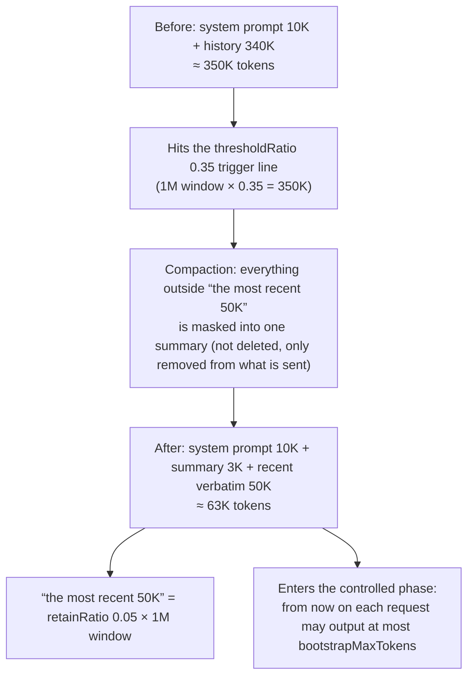

# dsh-compact-agents

<div align="center">

**Plugin for DeepSeek Harness: force-compact session context from the model itself (`compact_agents`)**

Force compaction ignoring the automatic threshold · Covers **every live session** in the process (main session / ordinary sub-agents / AgentTeams members alike) · The main session can compact itself even with no sub-agents · A busy target is queued and compacted the moment its turn ends · Per-target reporting of shadowed node count and estimated tokens · Only a top-level agent may sweep, sub-agent overreach is refused · Serial (non-concurrent) tool scheduling · **Compaction is visible in the conversation** · **Auto-continues after an output-cap truncation** · **Thresholds and friends are editable in Settings** · No network, no dependencies; the browser half is hand-written with no build step

[](https://github.com/zhuto666/dsh-compact-agents)

**v0.3.0**: compaction is visible in the conversation, and a turn truncated by the output cap continues itself. The plugin supplies the model-side manual compaction entry point DSH was missing — `/compact` only serves interactive UI adapters, headless sub-agents and team members have no command surface, and a captain had no tool to compact them — and it now leaves a **visible notice for both automatic and manual compaction** ("Compacting context…", "~213,400 → ~49,800 tokens"). See the [design notes](docs/design.md).

[](LICENSE)
[](https://github.com/deepseek-ai/deepseek-harness)
[](https://nodejs.org)

**English** | [中文](README.md)

</div>

---

## Feature overview

| Capability | Entry / parameter | Description |
|---|---|---|
| Force compaction (**ignores the automatic threshold**) | `compact_agents(scope)` | Calls `ctx.compaction.compactNow`, whose contract reads *"Explicitly compact useful history **even below automatic pressure thresholds**"*. Automatic compaction waits for the threshold; this tool does not |
| Covers **every live session** | `scope: "others"` (default) / `"all"` | The range is `ctx.agents.list()` — the main session, ordinary sub-agents and AgentTeams members are treated **alike**; it is not limited to team members |
| The main session compacts itself | `scope: "self"` | **Works with no sub-agents at all**: the caller is always mid-turn, so it necessarily takes the queued path and is compacted when its own turn ends |
| Named targets | `scope: "ids"` + `ids: [...]` | Compacts only the listed sessions; unknown ids are reported separately instead of being silently dropped |
| Queue when busy | `whenBusy: "queue"` (default) | A target that is mid-turn is not abandoned: its `agent/status → idle` is watched and it is compacted **the moment that turn ends**. `"skip"` reports `busy` and leaves it untouched |
| Per-target reporting | return value `results[]` | Each target gets `compacted` / `queued` / `noop` / `busy` / `error`, plus shadowed node count and estimated tokens |
| Overreach protection | — | Only a **top-level** agent may sweep others; a sub-agent may only use `scope: "self"`, so members cannot compact each other or their captain |
| Serial scheduling | — | Registered as fail-closed `exclusive`: one sweep never runs alongside another call that might compact the same session. Timeout 30 minutes (queued work runs after the turn and is not covered by it) |
| Automatic threshold (companion) | `compaction-basic` config | This plugin does **not** change automatic policy; the installer also reports `thresholdRatio` (the DSH default 0.8 × 1M = 800K effectively never fires; the default is 0.35, i.e. 350K) |
| **Compaction is visible in the conversation** | on by default; `notice: false` turns it off | Subscribes to `session/event`: the moment `compaction/start` lands, one plugin-sourced `user/message` is appended to the surface tail, and the client renders it as a collapsed "Context injection · dsh-compact-agents" row — *Compacting context… (currently 213,400 tokens) · trigger line ×0.35* while running, *Context compacted: ~213,400 → ~49,800 tokens, 37 history nodes shadowed* when done. `compaction/start` is written **before** the summarization model call, so the notice covers exactly the wait that used to look frozen. **The notice reports the trigger line this session actually runs**; if hot-syncing ever fails, both values and the "a new conversation picks it up" fix are stated right there |

## Why it is needed

DSH's only manual compaction entry point is the **human command** `/compact` (registered by `@deepseek-ai/dsh-command-compact` through `ctx.commands.register`, serving interactive UI adapters only). Consequently:

- headless **sub-agents / AgentTeams members** have no command surface and cannot run `/compact`;
- a **captain has no tool at all** to compact them — there is no `registerTool` anywhere under `packages/compaction/`;
- automatic compaction (`compaction-basic`) is **threshold-driven**: below the line, nothing happens.

So "sessions get more expensive the longer they run" used to be solvable only by **swapping people** (retire a member, spawn a new one). This plugin supplies the missing model-side entry point.

> A real lesson: one member session was re-sending roughly **400K tokens of context per call** by its 348th call — 140M cacheRead tokens, ¥10.87 — purely because nobody could compact it.

## Installation

> Requirements: Node.js ≥ 20 + DeepSeek Harness (a version that ships `agent-presets`).

### One-shot install (recommended)

```sh
git clone https://github.com/zhuto666/dsh-compact-agents.git
cd dsh-compact-agents
node scripts/install.mjs --dry-run     # preview the changes first (touches nothing)
node scripts/install.mjs               # apply (profile defaults to web; use --profile to change it)
```

The script does the following, and is **idempotent**:

1. **Creates three directory junctions** so the plugin can resolve `@deepseek-ai/dsh-tools`, `@deepseek-ai/cordis` and `@deepseek-ai/schemastery` — this project is deliberately **dependency-free** (no `node_modules` install). Node resolves junctions to their real path, so the plugin gets the **same module instance** as the host, with no duplicate-instance hazard.
2. **Appends one mount row** to the `compaction` isolate group of each preset (the `compact_agents` tool, the notices and auto-continue all rely on it):

```yaml
    - id: compact-agents
      name: '/absolute/path/to/dsh-compact-agents/index.js'   # the installer fills in your real absolute path
```

3. **Registers this package in the host composition** (the browser half — the Settings card — relies on it): it creates a `dsh-compact-agents` junction under `<DSH_HOME>/profiles/<profile>/node_modules/` pointing at this repository, and adds `dsh-compact-agents` to that profile's `dsh.profile.bundles` in `package.json` — so the host Loader gains a `compact-agents-client-host` row (injected by this package's `dsh.bundle.patch` → `cordis.patch.yml`, entry `client-host.js`). Pick the profile with `--profile <name>`, default `web`; a `<package.json>.bak-compact-agents` copy is written first.

**Restart `dsh` once after installing**: the host composition changed (the profile gained a bundle), and only after that restart does the card appear under **Settings → Plugins**. Afterwards, changing only preset parameters needs no restart (see "Activation").

It auto-discovers `$DSH_HOME/.agent-presets/*/agent.cordis.yml` and `$DSH_HOME/profiles/*/node_modules/@linxin666/*/presets/*/agent.cordis.yml`; use `--preset <file>` to name files explicitly. A `.bak` backup is written before any edit, and presets without a `compaction` group are skipped.

**The DSH checkout is auto-detected too — no drive letter is hard-coded in the scripts or the docs.** In order:

1. `--dsh <checkout>` / `$DSH_CHECKOUT` / `$DSH_HARNESS`;
2. an existing junction target in this project's `node_modules` (one install is enough to record where the checkout lives);
3. **the real entry recorded in the `dsh` launcher on `PATH`** (the package manager's shim names where `dsh` lives) — on a fresh clone with no other clue, this is the one that works;
4. every profile's `node_modules`;
5. common clone locations under the home directory.

Only when all of them miss does it fail, with a hint to pass `--dsh`.

**That path is not hard-coded — it is computed at install time.** `install.mjs` derives `PLUGIN_ENTRY` from its own location, so:

- wherever you clone or keep this project, that is what the row points at;
- **after moving or renaming the project, re-running `install.mjs` fixes it automatically**: a row pointing at a path that no longer exists is repaired outright; if the old path is still valid (say a second copy exists) it only warns, and `--force` repoints it.

```sh
node scripts/install.mjs --dry-run    # preview (touches nothing)
node scripts/install.mjs              # apply; repairs a stale path automatically
node scripts/install.mjs --force      # repoint even when the old path is still valid
```

> **Why can it not simply name a package, like an ordinary dependency?** That is DSH's own semantics, not laziness: a **bare package name in a preset row resolves from the harness installation** (`agent-presets/src/mount.ts`, `PresetTree.import`: *"a package name resolves from the harness base"*), not from the user directory, so a package installed in a workspace or home directory is simply not found. A third-party preset row therefore has exactly two options — an absolute path, or shipping the plugin file inside the preset directory. This project takes the first: **a single source of truth**, with no per-preset copies to drift.

### Why two mount points (host composition + preset)

The two mount points are **both required**; each covers half the job:

| Mount point | Carrier | Responsibility |
|---|---|---|
| The preset row | the `compact-agents` row in the `compaction` group of `<DSH_HOME>/.agent-presets/*/agent.cordis.yml` (an absolute path pointing at this repository's `index.js`) | the `compact_agents` tool, the compaction notices, and auto-continue after an output-cap truncation. It **must stay inside the `compaction` realm**: cordis isolation is keyed by service name, so outside the realm `ctx.compaction` cannot be resolved |
| The bundle row in the host composition | the profile's `dsh.profile.bundles` lists this package → this package's `dsh.bundle.patch` points at `cordis.patch.yml` → it inserts `id: compact-agents-client-host` / `name: 'dsh-compact-agents/client-host'` (entry `client-host.js`) | lets DSH's client module table discover this package's `dsh.client` declaration (and therefore ship `lib/client.js` to the browser), and registers the settings namespace on the host root |

**Mounting it in the preset alone is not enough**: DSH's `ClientModuleRegistry` (`packages/client/modules/src/index.ts`) decides which client bundles reach the browser and it **only walks the host Loader's entries** — its `internal/plugin` listener contains `const entryName = fiber.entry?.options.name; if (entryName === undefined) return`, whose comment says outright that a plugin with no `fiber.entry` is a child plugin or a manual mount, and drops it; the constructor likewise only does `for (const entry of ctx.loader.entries())`. The preset row is **manually mounted** by `agent-presets` through `internal.import`, so it is not a loader row. Therefore **with a preset-only install the browser half is never delivered**, and the symptom is that Settings shows neither the namespace nor the card — **with no error at all**. Root cause and source locations: [design notes §8.4](docs/design.md).

`client-host.js`, the root entry, deliberately declares `inject = []`: there is **no** `compaction` service on the host root (it is provided by `compaction-basic` inside the preset realm), so declaring that dependency would only leave the row pending forever. It does exactly two things: let the client module table discover this package, and register the settings namespace on the host root. Both entries call `registerSettings`, and a module-level cache keeps registration process-wide once (the real `SettingsProvider.register` throws on a duplicate namespace).

> This is not an invented shape: the installed third-party plugin `@a9i5k4/dsh-auto-memory` declares the same `dsh.bundle.patch`, `dsh.client` and `exports['./client']`, with a patch body of `- insert: [ { id, name } ]`. This plugin follows the same shape.

### Activation

What you changed decides how it takes effect:

| What changed | How it takes effect |
|---|---|
| **The host composition** (the bundle row added by the first install, `client-host.js`, `cordis.patch.yml`, the `dsh.*` declarations in `package.json`) | **A `dsh` restart is required** — only then does the card appear in Settings |
| A preset's **compaction threshold / retention ratio** | **Effective on save**: this plugin hot-syncs the new value into running sessions (the next step boundary uses it) and writes the preset file for new sessions |
| A preset's **controlled-phase output budget** (`tool-bootstrap`) and the **mount row** | **A new conversation** is enough; no restart |
| The plugin's own `.js` | **A `dsh` restart is required** (ESM module cache; see "Local development") |

Preset edits hot-reload through the standing mount's **file stamp** (the `stat` `mtimeMs` + `size`): when the stamp changes, the next new session mounts a fresh generation and gets the tool. Sessions that are already composed keep the old generation because `select` / `swap` refuses with `agent-preset/locked`, exactly as designed.

**The threshold and retention ratio do not have to wait for that step**: this plugin subscribes to the Settings save event, reads the new preset values and writes them straight into the running `compaction-basic` instance — its `config` is an ordinary own property (the object is frozen, the reference is not), and the pressure check re-reads it on every call, so **the very next step boundary judges against the new threshold**. No new conversation, no restart. `bootstrapMaxTokens` belongs to another plugin (`tool-bootstrap.mjs` captures it in a closure at `apply()`), so it still only applies to new sessions.

The compaction notice reports the **trigger line this session actually runs**; only when hot-syncing genuinely fails (the config shape changed / not writable) does it add a line naming both values and the way out:

```
⚠️ the preset files now say ×0.5 while this session's instance still runs ×0.2 (hot-sync failed): a new
conversation is what picks up the new value.
```

The row config `livePresetParams: false` turns hot-syncing off (back to the old "new sessions only" behaviour).

**It also proves itself** (v0.7.1): writing the value is not the same as the engine using it. After a hot-sync the plugin re-derives the outcome from the next **policy-driven** compaction — the line test is `tokens >= window × ratio`, so if a 1M window still compacts at 250K after the ratio went 0.2 → 0.5, the engine is still judging by 0.2. The plugin then stops claiming success: it reports ×0.2 and names the way out (a new conversation). Manual compaction (`/compact`, or the run triggered by the `compact_agents` tool) can happen at any token count and is never taken as evidence, so the engine is not accused wrongly.

> **To compact the members you already have, do not restart DSH** — a restart drops every member/sub-agent session (`ctx.agents.list()` only covers live sessions), leaving nothing to compact. Opening a new conversation leaves them untouched.
>
> The first install therefore has an ordering conflict: "see the Settings card" and "do not lose member sessions" cannot both hold — compact first and then restart, or restart and re-open the members. The `compact_agents` tool itself does not depend on that restart: once the preset row is in place, a new conversation is enough.

### Verifying the install

```sh
node scripts/validate-presets.mjs
```

It reports the mount row's location per preset, whether the referenced file exists, and `compaction-basic`'s `thresholdRatio` / `retainRatio`. Expected output:

```
.agent-presets/liangshen/agent.cordis.yml
  rows           = compaction-basic,command-compact,compact-agents,tool-result-pruner
  thresholdRatio = 0.35  retainRatio = 0.05
  compact-agents -> /absolute/path/to/dsh-compact-agents/index.js (exists)
ALL OK (4 preset mounted)
```

Which initial values the Settings card will show can be checked read-only (it writes no file at all):

```sh
node scripts/inspect-presets.mjs
```

### Update / uninstall

```sh
git -C dsh-compact-agents pull          # update: pull, then re-run install.mjs (idempotent)
node scripts/uninstall.mjs --dry-run       # uninstall: preview first
node scripts/uninstall.mjs                 # remove the mount row + the profile bundle entry + the junctions it created
```

Uninstall removes only what it added: comments, `!!js` expressions and every other row in a preset are left alone (verified byte-for-byte round trip from installed back to original), and the bundle entry in the profile's `package.json` is removed line-wise with the original layout preserved. The plugin directory and the `.bak` / `.bak-compact-agents` backups are kept; remove them yourself. Uninstall changes the host composition too, so **the Settings card disappears only after a `dsh` restart**.

### Local development

```sh
node scripts/integration-test.mjs    # real-machine load test (real cordis Context + real ToolRuntime)
node scripts/deferred-test.mjs       # queue-then-compact behaviour test (fake ctx)
node scripts/selftest.mjs            # module import + defineTool spec self-check
```

Editing `index.js` **requires a `dsh` restart to take effect** — an easy trap:

- Node's **ESM module cache is keyed by URL**, and re-mounting a preset does **not** clear it (DSH's own HMR plugin can hot-reload only because it explicitly clears `internal.loadCache`, and it ships `disabled` in the profile);
- so "open a new conversation" only re-mounts the **preset**; the plugin module itself is still the copy already cached in the process;
- the `scripts/*.mjs` files are plain scripts executed fresh each time, so they are **not** affected.

> A new conversation is enough only when you changed **a preset**; **changing the plugin's `.js` (including `client-host.js` / `settings.js`) or anything host-composition related (`cordis.patch.yml`, the `dsh.*` declarations in `package.json`) requires restarting `dsh`**.

## Usage

Called by the model (it is not a human command):

```
compact_agents(scope = "others" | "all" | "self" | "ids", ids?: string[], whenBusy = "queue" | "skip")
```

| scope | Meaning |
|---|---|
| `others` (default) | **Every live session** except the caller |
| `all` | **Every live session**, including the caller |
| `self` | Only the caller's own session — **works with no sub-agents at all** |
| `ids` | Only the sessions named in `ids` |

Typical prompts:

- "compact every other session" → `scope: "others"`
- "compact this conversation too" → `scope: "all"` (you are queued and compacted when this turn ends)
- "compact only myself" → `scope: "self"`

> **Model did not call it?** The tool description already says to call this **immediately** when the user asks to compress context, never to ask back first — but a model may still choose to confirm. The most reliable phrasing **names the tool**:
>
> ```
> call compact_agents with scope=all to compress every session
> ```
>
> The tool is independent of model behaviour: as long as it is in the tool catalog, naming it always executes.

One row is returned per target, for example:

```
compact_agents: 3 compacted, 1 queued, 0 skipped, 0 failed (of 4 selected).
- sess_ab12: compacted, ~213,400 → ~49,800 tokens — shadowed surface 12-107
- sess_cd34: compacted, ~52,100 → ~9,040 tokens — shadowed surface 3-33
- sess_ef56: noop, ~0 tokens shadowed — nothing safely compactable (empty session, or one oversized retained unit)
- sess_gh78: queued — mid-turn; queued and will be compacted as soon as it goes idle
```

`beforeTokens` / `afterTokens` are the surface estimates measured with `ctx.tokenMeter` before and after the
compaction; `-1` means the meter was unavailable.

### The compaction notice in the conversation

Beyond the tool, **every** compaction — including the threshold-triggered automatic one — leaves a visible
notice in the conversation, in the same collapsed-row shape the framework uses for its own context
injections:

```
▸ Context injection · dsh-compact-agents · Compacting context… (currently 213,400 tokens) · trigger line ×0.35
▸ Context injection · dsh-compact-agents · Context compacted: ~213,400 → ~49,800 tokens, 37 history nodes shadowed
```

`compaction/start` is written to the session log **before** the summarization model call, so the first notice
lands exactly inside the wait that used to show nothing. The row config `notice: false` turns it off (the tool
is unaffected).

The `trigger line ×0.35` at the end of the collapsed row is **the value this session actually runs**. Normally it
always matches the preset files — saving the card hot-syncs the new value into running sessions; only when that
fails does the row add one line:

```
⚠️ the preset files now say ×0.5 while this session's instance still runs ×0.2 (hot-sync failed): a new
conversation is what picks up the new value.
```

### Automatic "continue" when the output cap truncates a turn

When a turn ends with `turn/end{reason: {kind: 'max-tokens'}}` (DeepSeek's `finish_reason: 'length'`), the
plugin **sends "继续" on the user's behalf** so the conversation keeps going instead of waiting for a human:

```
▸ Context injection · dsh-compact-agents · previous turn hit the output cap; auto-continued (1/2)
继续                                    ← sent by the plugin as the user (identical to a typed message)
```

- The budget is bounded by the row config `maxAutoContinues`, **default 2**; `0` or `false` disables it. Once
  exhausted it stops and posts a notice instead, so a "truncate → continue → truncate again" loop cannot burn
  tokens forever.
- **Any normally completed turn resets it**, so the budget counts *consecutive* truncations.
- The message is a standard `user/message` (`source.kind: 'user'`, frozen, unique id) delivered through
  `agent.followup` — the same path a message typed in the UI takes, not a surface append that never wakes the
  model.

> **Why it is needed**: after a compaction a preset often shrinks the **next request's output budget** to a
> tiny window in order to re-anchor. When the model runs with high reasoning effort, reasoning tokens share
> that budget and can consume all of it → zero visible output → the turn is reported as truncated. See
> [design notes §7](docs/design.md).

### Editing these parameters in Settings

Open **Settings → Plugins** and you will find a `Compaction & auto-continue` card:


> This card is a **pure parameter card**: the plugin has **no buttons of its own** in the UI — compaction and
> auto-continue both happen **automatically**. The `Reset` next to a field is just the Settings framework's own
> restore affordance and never triggers a compaction.
> The only manual compaction entry point in DSH is the **built-in** human command `/compact` (not this plugin);
> what this plugin provides is the **model-side** tool `compact_agents`, which the model calls — it is not
> something a human clicks.

| Field | Meaning | Takes effect |
|---|---|---|
| Compaction trigger ratio | `0.35` = compact once the context reaches 350K | **New sessions** |
| Retained ratio | how much recent history survives a compaction | **New sessions** |
| Controlled-phase output budget | the per-request output budget during the `controlled` phase, re-entered after every compaction | **New sessions** |
| Compaction notices | whether to announce *compacting context… / compaction done* in the conversation | Immediately |
| Auto-continue budget | how many automatic `continue` turns after an output-cap truncation (0 = off) | Immediately |

The card also marks the fields **you have overridden**, each with its own `Reset`.

What the card looks like is shown in the annotated screenshot above; the numbers in the image match the legend on its right. [docs/images](docs/images/README.md) records where these images come from and how they are made (real UI captures plus annotations, containing no personal information), along with the naming and placement rules for any future screenshot.

The card can only appear if **that row exists in the host composition** (this package registered as a profile bundle, and therefore inserted into the host Loader): with a preset-only mount the browser never receives `lib/client.js`, and the symptom is that Settings shows neither the namespace nor the card — with no error at all. So **restart `dsh` after the first install and after any change to the host composition** (root cause in [design notes §8.4](docs/design.md)).

Why two different effect timings:

- The first three values **belong to other preset plugins** (`compaction-basic` owns `thresholdRatio`/`retainRatio`, `tool-bootstrap` owns `bootstrapMaxTokens`). This plugin cannot change their runtime policy, so it writes the **preset files themselves**. A preset mount records a file stamp, and a changed stamp starts the next generation **for sessions created afterwards** — so no DSH restart is needed, but already-running sessions are unaffected. Before writing it keeps a `<preset>.bak-compact-agents` copy and replaces the file atomically (temp file + rename); only the target line changes, so comments and formatting survive.
- The last two values **belong to this plugin** and are read at event time, so they apply immediately.

> `settings: false` turns the whole Settings surface off (the tool and the notices are unaffected).

### What each parameter actually controls

The table above only says *what a field means*. This section says **what the parameter actually governs, and
what happens when you turn it up or down**. For the design rationale behind it, see
[design notes §9](docs/design.md).

First, what one compaction looks like end to end (1M window ≈ 1,000,000 tokens, preset using `0.35` / `0.05`):

```
Before   system prompt 10K + history 340K = 350K
         └─ hits the thresholdRatio 0.35 trigger line → compaction starts

During   everything outside "the most recent 50K" is 【masked】
         └─ not deleted but removed from what is sent, and replaced by a summary;
            the "masked node count" reported in the compaction notice is exactly this

After    system prompt 10K + summary 3K + recent verbatim 50K ≈ 63K
         └─ that "recent 50K" comes from retainRatio 0.05 × window 1M

Then     the 【controlled phase】 begins: from now on each request may output
         at most bootstrapMaxTokens tokens
```

The three numbers each govern one segment, with no overlap: `thresholdRatio` governs **when to compact**,
`retainRatio` governs **how much verbatim history survives**, and `bootstrapMaxTokens` governs **how much the
model may say in the turns right after a compaction**. None of them governs how good the summary is — that is
the summarization model's job.

Drawn as a chart, the same chain is one compaction end to end (the numbers match the prose version above):



There is a single thread: **hits the line → masked into a summary → enters the controlled phase**. The sections
below take it apart segment by segment.

#### Retained ratio `retainRatio`

It is essentially the **fidelity boundary**: content inside the line is kept **verbatim, word for word**;
outside the line only the summary remains.

- Its unit is a **fraction of the window**, not a message count: `0.05` × 1M = **keep the most recent 50K
  tokens verbatim**.
- **Why a block of verbatim text is mandatory**: a summary always loses detail, and the most recent content
  is exactly what is most likely needed next (code just pasted, a requirement just stated, an error just
  corrected). If it gets summarized away, you get "it acts as if I never said that".
- **Symptom of tuning it down**: `0.01` = keep only 10K. A few-hundred-line source file is roughly 10K tokens,
  so it is summarized away the moment you compact — the model "forgets" it immediately.
- **Symptom of tuning it up**: `0.2` = keep 200K, so ~250K remains after a compaction and the trigger line is
  hit again very soon → repeated compaction, repeated interruptions.
- **Recommendation**: `0.05` is enough for ordinary conversation; **if you often paste large files, raise it to
  `0.08~0.1`**.

#### Controlled-phase output budget `bootstrapMaxTokens`

It is an **output** budget, not an input budget: for that short stretch after a compaction, it caps **how many
tokens the model may output per request**.

- **The easiest trap: `max_tokens` also counts reasoning tokens.** So at `1024` the reasoning alone can consume
  the whole budget and leave zero visible text — showing up as an "empty reply" or a sentence cut off mid-way.
  (This is in fact one of the reasons this plugin exists: the 4 truncations observed earlier were all
  `outputTokens=1024` with 0 characters of visible text.)
- **Why "controlled" at all**: right after a compaction the model holds a brand-new summary and will happily
  write a long essay, **refilling** the space that was just freed — making the compaction pointless. So the
  preset pushes the session back into the controlled phase **after every compaction** and clamps the output;
  once the session is "promoted" (released from the controlled phase) the model's own large budget returns.
  **It is a temporary throttle after a compaction, not a permanent setting.**
- **Tuning it down**: `16384 → 1024` saves tokens but truncates very easily.
- **Tuning it up**: `32768` rarely truncates, but every controlled-phase turn can be expensive.
- **It works together with auto-continue**: too small a budget → the reply is truncated → auto-continue sends
  "continue" to finish the thought, so what you see is **sawtooth output** (half a sentence → automatic
  continue → the rest). `16384` is the compromise.
- **Recommendation**: if replies often stop mid-sentence or come back empty, raise it to `32768`; if the turns
  right after a compaction are absurdly long, keep `16384` or lower.

#### Cheat sheet

| What you want | What to change |
|---|---|
| Cheaper and faster | lower the threshold (compact earlier) + lower the retained ratio |
| Fewer interruptions, remember what was just said | raise the retained ratio (`0.08~0.1`) |
| Controlled phase keeps truncating (repeated auto-continue) | raise the output budget (`32768`) |
| Compaction is too frequent, tired of it always summarizing | raise the threshold (`0.3~0.4`) |

#### Effect timing and restoring defaults

- The first three (compaction trigger ratio, retained ratio, controlled-phase output budget) are **written into
  the preset files**, so they **only affect sessions created afterwards**; already-running sessions are
  unaffected.
- The last two (compaction notices, auto-continue budget) belong to this plugin, so they **apply immediately**.
- **To restore defaults**: the `Reset` button next to each field goes back to the value in the preset;
  `thresholdRatio` set to `0.8` is the DSH factory value (roughly equivalent to never triggering).

## How it works

For each target it calls `ctx.compaction.compactNow(agent, signal)` and turns the outcome into a report row.

It does **not** bypass the contract's own constraints:

| Constraint | Reason |
|---|---|
| A target must be **idle** to compact immediately | `compactNow` goes through `agent.runMaintenance`, which throws `ManualCompactionError('busy')` synchronously while an agent is running a turn |
| **The caller is always busy** | It is executing this very tool call — so it takes `queue` and is compacted at the **end of its own turn** |
| Only a **top-level** agent may sweep | Prevents members from compacting each other or their captain; a sub-agent may only use `scope: "self"` |
| One summarization model call per target, **serially** | Every target costs a real model call; queued work runs after the turn and is not covered by the tool timeout |
| **Live** sessions only | Ended/archived sessions have no live agent and `compactNow` needs an Agent handle; compacting a dead session saves nothing |
| Compaction **cannot** fix a single oversized unit | Per contract, one oversized retained unit or request envelope cannot be repaired by surface compaction; such a target reports `noop` |

Details (contract citations, event semantics, pitfalls) are in the [design notes](docs/design.md).

## State and side effects

- **Zero persistence**: writes no files, keeps no ledger, changes no configuration; the compaction result is recorded by DSH's own session log.
- **Zero network**: the only model call is the summarization issued by `compaction-basic` through the host LLM channel; the plugin itself makes no outbound requests.
- **Does not alter automatic policy**: the threshold and retention ratio belong to `compaction-basic` in the preset; this plugin does not override them.
- **Removable at any time**: delete the mount row and the bundle entry in the host composition (both are restored by `uninstall.mjs`) and nothing is left behind; a `dsh` restart is needed on the host side as well.
- **Auto-continue speaks as you**: the `继续` message uses `source.kind: 'user'`, so it renders as an ordinary
  user bubble (with a notice row explaining that the plugin sent it). That is deliberate — a `plugin` source
  could be filtered out of the model surface by a preset's `messageSources` allowlist. Set
  `maxAutoContinues: 0` to opt out.
- **The notice enters the session (and therefore the model context)**: it is a `user/message`, so the model
  sees it on the next request — that is deliberate (it tells the model the context was just compacted). It
  costs a few dozen tokens per compaction, and the next compaction shadows it along with everything else.
  Set `notice: false` to opt out.

## Architecture

```
dsh-compact-agents
├── index.js                     # the preset-row entry: registers the compact_agents tool + session listeners (notices / auto-continue)
├── client-host.js               # the host-composition entry: does exactly two things (ship the browser half, register the settings namespace)
├── cordis.patch.yml             # dsh.bundle.patch: inserts the compact-agents-client-host row into the host composition
├── settings.js                  # the Settings surface: settings namespace + preset parameter read/write (shared by both entries)
├── lib/client.js                # the browser half: the Settings card (hand-written, no build step)
├── package.json                 # ESM package declaration (main -> index.js; dsh.client -> lib/client.js; dsh.bundle.patch -> cordis.patch.yml)
├── scripts/
│   ├── lib/presets.mjs          # shared by the scripts: path constants + preset discovery (one definition)
│   ├── install.mjs              # one-shot install/repair: junctions + preset row + profile bundle (idempotent, keeps .bak)
│   ├── uninstall.mjs            # uninstall: remove the mount row + delete the junctions / bundle entry it created
│   ├── validate-presets.mjs     # validate mount row / threshold / path
│   ├── inspect-presets.mjs      # read-only self-check: the effective values read from the real presets
│   ├── compose-test.mjs         # composition check: real FileSettingsProvider + replicated preset isolation (temp fixture only)
│   ├── settings-test.mjs        # Settings surface test (real schemastery + preset text surgery)
│   ├── client-test.mjs          # browser half test (fake __ModuleLoader__ + stub require)
│   ├── integration-test.mjs     # real-machine load test (real Context + real ToolRuntime)
│   ├── deferred-test.mjs        # queue-then-compact behaviour test (fake ctx)
│   ├── dryrun-test.mjs          # `--dry-run` guard: a rehearsal never really deletes (sandboxed DSH_HOME)
│   └── selftest.mjs             # module and defineTool spec self-check
├── docs/
│   └── design.md                # design notes: contract citations, constraints, pitfalls, test matrix
└── node_modules/@deepseek-ai/   # junctions created by install.mjs (not committed)
    ├── dsh-tools    -> <dsh checkout>/packages/core/tools
    ├── cordis       -> <dsh checkout>/vendor/cordis
    └── schemastery  -> <dsh checkout>/vendor/schemastery
```

`install.mjs` additionally creates a junction under that profile, `<DSH_HOME>/profiles/<profile>/node_modules/dsh-compact-agents -> <this repository>`, and registers the package name in the profile's `dsh.profile.bundles` (see below).

**Two mount points, both required**:

| Mount point | How it gets there | Responsibility |
|---|---|---|
| The preset row | `install.mjs` appends it to the `compaction` group of `<DSH_HOME>/.agent-presets/*/agent.cordis.yml` | the `compact_agents` tool, the compaction notices, auto-continue. It must stay inside the `compaction` realm, or `ctx.compaction` cannot be resolved |
| The bundle row in the host composition | `install.mjs --profile`: the profile's `dsh.profile.bundles` lists this package → this package's `dsh.bundle.patch` (`cordis.patch.yml`) inserts `id: compact-agents-client-host` / `name: 'dsh-compact-agents/client-host'` | discovered by `ClientModuleRegistry` (which ships `lib/client.js`), and registers the settings namespace on the host root |

`client-host.js` deliberately declares `inject = []` — there is no `compaction` service on the host root (it is provided by `compaction-basic` inside the preset realm), so declaring that dependency would only leave the row pending forever. It does exactly two things: let the client module table discover this package, and register the settings namespace on the host root.

**Why the preset alone is not enough**: `ClientModuleRegistry` (`packages/client/modules/src/index.ts`) only walks the **host Loader's entries**, and its `internal/plugin` listener contains `const entryName = fiber.entry?.options.name; if (entryName === undefined) return` — a plugin with no `fiber.entry` ("a child plugin or a manual mount") is dropped; the preset row is exactly such a manual mount, created by `agent-presets` through `internal.import`, not a loader row. The result: with a preset-only install the browser half is never delivered, Settings shows neither the namespace nor the card, **and nothing is logged**. See [design notes §8.4](docs/design.md).

The plugin imports `defineTool` (from `@deepseek-ai/dsh-tools`) and **dynamically** imports `@deepseek-ai/schemastery` to declare its settings schema. The latter two junctions are needed only by the Settings surface and the tests; **a missing `schemastery` junction costs you one settings card, never the plugin** (the dynamic import only logs a warning).

**Why the preset row must be an absolute path**: `agent-presets/src/specifier.ts` classifies an absolute drive-letter path through `pathToFileURL` (its comment says this is *"required for drive-letter paths on Windows"*), producing a `file:` row. A **bare package name inside a preset is resolved from the harness**, not from the caller's directory, so a package installed under the user directory would fail to resolve.

## Development and verification

```sh
node --check index.js                 # syntax check
node scripts/selftest.mjs             # module import + defineTool spec + parameter enums
node scripts/deferred-test.mjs        # busy -> queued -> compacted on idle (fake ctx, no DSH)
node scripts/integration-test.mjs     # real machine: real Context + real ToolRuntime, full chain
node scripts/compose-test.mjs         # composition: real FileSettingsProvider + replicated preset isolation
node scripts/inspect-presets.mjs      # read-only: the initial values the Settings card will show
node scripts/validate-presets.mjs     # mount rows and thresholds of all presets
node scripts/install.mjs --dry-run    # install rehearsal (touches nothing)
```

`integration-test.mjs` covers what a fake ctx cannot, at **zero model calls and zero cost** (it substitutes three minimal stub services — `systemPrompt`, `compaction`, `agents`): `inject` really resolves, `ctx.tools.register(defineTool(...))` is really accepted by the registry, `ctx.tools.get()` finds the tool, `ctx.tools.executionMode()` really resolves to `exclusive`, an end-to-end `execute()` return value really passes the output schema, `render()` really produces a text block, and a non-top-level sweep really is refused. The full assertion list is in the [design notes](docs/design.md#4-验证矩阵).

`compose-test.mjs` instead uses the **real `FileSettingsProvider` from the checkout** (writing to a temp file) plus a replication of the preset's `isolate` semantics, to prove the settings namespace also registers under the real service and a real isolated realm; it also deliberately **mounts the host-composition row before the `settings` service exists**, proving that the `ctx.inject` wait path really completes registration once the service arrives.

> ⚠️ **Test-isolation lesson**: `compose-test.mjs` walks the real `update → watch → write-back` chain, so it must first point preset reads/writes at a **temp fixture** with `setPresetFilesForTest()` — the first version skipped that step and the "verification" script **actually rewrote the user's preset** (it wrote `thresholdRatio` as `0.42`). It now snapshots the real presets **byte for byte** at the start of the run and compares at the end, so a single changed character fails the run immediately (`npm test` runs it; `node scripts/compose-test.mjs` also works standalone). The check is deliberately **not** "the ratio must equal some number": `thresholdRatio` is a knob users are told to tune, and hard-coding an expected value turns "the user tuned it" into a false "the test polluted the config". Any test that writes to disk must point its fixture at a temp file explicitly — never rely on "I assumed it would not write".

## Known limitations

- **Live sessions only**: ended/archived sessions have no Agent handle, so historical sessions cannot be compacted after the fact (and compacting them would save nothing).
- **Compaction is not free**: each target costs a real summarization model call. The point is to trade that for the huge prefix re-sent on every subsequent call.
- **A single oversized retained unit cannot be repaired**: the contract says surface compaction cannot fix it, so the target reports `noop`.
- **`scope: "self"` is asynchronous**: the tool returns `queued` immediately and the actual compaction happens after the turn ends, with the result written to the DSH log (`ctx.logger.info`) rather than the tool result.
- **Already-composed sessions do not get the new tool**: a preset edit only affects new sessions; older ones need a new conversation (or a DSH restart, which would drop member sessions).
- **No orphan-data or state cleanup**: this plugin is stateless, so there is nothing to clean up.
- **DSH dev-checkout layout only**: the installer requires the checkout to contain both `packages/core/tools` and `vendor/cordis`; a global `npm i -g` installation is unverified (the two packages land elsewhere and would need separate handling).

## Changelog

- **v0.7.1** — an **effect check** for hot-syncing: writing a value is not the same as the engine using it. Each patch leaves something to be proven (the context window is looked up up-front, because the compaction path is synchronous and cannot wait), and the next **policy-driven** compaction settles it: the line test is `tokens >= window × ratio`, so if a 1M window still compacts at 250K after the ratio went 0.2 → 0.5, the engine is still judging by 0.2. When that is proven the plugin stops claiming success: it reports ×0.2 and names the way out (a new conversation). Manual compaction (`/compact`, and the run triggered by the `compact_agents` tool) can happen at any token count and is never accepted as evidence, so the engine is never accused wrongly; the check must also run before the sync, or the current compaction (decided under the old ratio) would be used as evidence for the new one.

- **v0.7.0** — **the threshold and retention ratio no longer wait for a new conversation**: once the Settings card is saved, the plugin hot-syncs the new values into the running `compaction-basic` instance (its `config` is an ordinary own property — the object is `deepFreeze`d, the reference is replaceable — and the pressure check re-reads it on every call), so the next step boundary judges against the new threshold: existing sessions take effect immediately, with no new conversation and no restart. Only those two knobs are touched: `bootstrapMaxTokens` belongs to `tool-bootstrap`, which captures it in a closure at `apply()`, so it still applies to new sessions only; with `modelPolicies`, only the matching entry changes (the same matching the engine's `resolveTargetPolicy` uses). Every write is read back for verification; when the value cannot be read or written the old behaviour stands and the compaction notice names both values. The row config `livePresetParams: false` disables it. The Settings card therefore gains a "written to the preset and hot-synced" group.

- **v0.6.1** — the compaction notice reports the **trigger line this session actually runs** (`· trigger line ×0.35`), and when hot-syncing fails it states both values plus "a new conversation picks it up". This closes a trap that is bound to be hit once: preset compaction parameters are read into `compaction-basic` at **session creation** and deep-frozen, and the old notice only reported token counts, never which threshold was in force. The Settings card's misleading hint was also reworded to say "default 0.35" explicitly: it used to read "(0.35 = 350K tokens)" right next to a user-set 0.5, which reads like the current value.

- **v0.6.0** — the default compaction trigger ratio moves from `0.2` (200K) to `0.35` (350K): the old default compacted early enough to summarize space that had not been used yet, while `0.35` means "compact when the window is nearly full". Also, the real-preset guard in `compose-test.mjs` no longer hard-codes "`thresholdRatio` must be 0.2" but compares against a byte-for-byte snapshot taken at startup, fixing a false positive once a user tuned the ratio to anything else.

- **v0.4.0** — every tuning knob moves into Settings:
  - New **Settings surface**: the host half registers the `compact-agents` settings namespace, and
    the browser half (`lib/client.js`) registers a card under the same key in the
    `settings.plugin.item` slot — official slot documentation: *"Keying on the namespace is what lets
    a plugin distributed outside this repository contribute a card"*. **Settings → Plugins**
    therefore gains a `Compaction & auto-continue` card;
  - Five editable fields: compaction trigger ratio, retained ratio, controlled-phase output budget,
    compaction notices, auto-continue budget. The first three belong to other preset plugins, so this
    plugin **writes the preset files** (backup + atomic replace + only the target line changes, so
    comments and formatting survive) which takes effect for newly created sessions; the last two
    belong to this plugin and apply **immediately**;
  - The browser half is a **hand-written single-file bundle** (DSH's client module system is a lazy
    CJS table — no bundler needed). It only requires the seed modules `react` and
    `@deepseek-ai/dsh-client-store`, so the project still has zero npm dependencies;
  - Two new test suites: `settings-test.mjs` (real schemastery + real cordis Context + preset text
    surgery, always through temp files so real configs are never touched) and `client-test.mjs`
    (fake `__ModuleLoader__` + stub require, assertions rendered through real React);
  - `install.mjs` creates one more junction, `@deepseek-ai/schemastery` (missing it costs one
    settings card, never the plugin).

- **v0.3.0** — auto-continue when the output cap truncates a turn:
  - A turn ending with `turn/end{reason: 'max-tokens'}` now gets an automatic "继续" sent as the user
    (`agent.followup` — the same path a typed message takes), so the conversation keeps going. The row config
    `maxAutoContinues` bounds the consecutive count (default 2; `0`/`false` disables), it reports instead of
    looping once exhausted, and any normally completed turn resets it;
  - A concrete real-world trigger is documented in [design notes §7](docs/design.md): **after a compaction a
    preset may shrink the next request's output budget** to re-anchor, and with high reasoning effort the
    reasoning tokens share that budget and can consume all of it → zero visible output → truncated turn.
    4/4 truncations in one session log appeared 9–12 records after `compaction/end`, all with
    `reasoning=1024/1024` and zero characters of text.

- **v0.2.0** — compaction is no longer silent:
  - A **visible compaction notice in the conversation**. Previously no chat node existed between
    `compaction/start` and `compaction/end` — the built-in automatic compaction behaves the same way
    (`正在压缩上下文…` appears only in the trajectory panel) — so it simply looked stuck. The plugin now
    subscribes to `session/event` and appends one plugin-sourced `user/message` at each end of the
    lifecycle, in exactly the shape the framework uses for its own context injections, and the row
    config `notice: false` disables it;
  - Tool rows now carry **before/after token counts** (`beforeTokens` / `afterTokens`; `-1` when the
    meter is unavailable), rendered as `~213,400 → ~49,800 tokens`.

- **v0.1.0** — first release: the `compact_agents` tool (four scopes, queue-when-busy), one-shot install/uninstall/validate scripts, and four verification layers (self-check / behaviour test / real-machine integration test / preset validation).
  - The installer repairs a **stale plugin path** (move or rename the project, re-run, done) and supports `--force` to repoint;
  - DSH checkout discovery is now **self-describing** (explicit args → existing junction → the `dsh` launcher on `PATH` → profiles → home directory); neither the scripts nor the docs contain a machine-specific drive letter;
  - `uninstall.mjs` removes only the row **pointing at this project**, so a second clone cannot tear down the first one's install by accident.

## License

[Apache-2.0](LICENSE)
