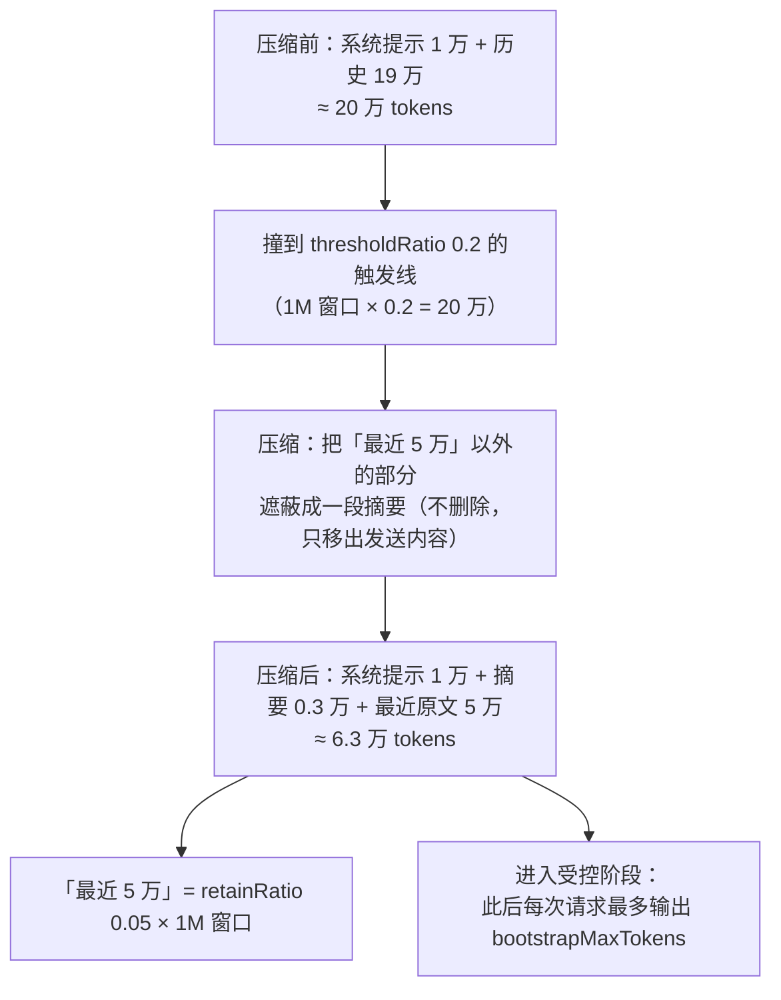

# dsh-compact-agents

<div align="center">

**DeepSeek Harness 会话上下文强制压缩插件(模型可调用的 `compact_agents`)**

强制压缩忽略自动阈值 · 覆盖进程内**所有活会话**(主会话 / 普通子代理 / AgentTeams 成员一视同仁) · 没有子代理时主会话也能压自己 · 忙的目标自动排队、本轮结束立即补压 · 逐目标回报被遮蔽节点数与估算 token 数 · 只有顶层 agent 能扫描、子代理越权被拒 · 工具调用串行不并发 · **压缩过程在对话区可见** · **被输出上限截断时自动续写** · **压缩阈值等参数可在「设置」里直接改** · 零网络、零依赖、浏览器 half 手写无构建步骤

[](https://github.com/zhuto666/dsh-compact-agents)

**v0.4.0**：所有压缩相关参数搬进「设置」界面。压缩触发阈值、保留比例、受控阶段输出预算、提示开关、自动续写次数 —— 五项都能在 **设置 → 插件 → 可配置** 里改，不用再编辑 preset 的 YAML；顺带补上「被输出上限截断时自动续写」，让对话不再停在"已达到输出 token 上限"。详见[设计说明](docs/design.md)。

[](LICENSE)
[](https://github.com/deepseek-ai/deepseek-harness)
[](https://nodejs.org)

[English](README.en.md) | **中文**

</div>

---

## 功能总览

| 能力 | 入口 / 参数 | 说明 |
|---|---|---|
| 强制压缩(**忽略自动阈值**) | `compact_agents(scope)` | 走 `ctx.compaction.compactNow`，契约原文是*"Explicitly compact useful history **even below automatic pressure thresholds**"*；自动压缩要等阈值，本工具不等 |
| 覆盖**所有活会话** | `scope: "others"`(默认) / `"all"` | 覆盖范围是 `ctx.agents.list()`——主会话、普通子代理、AgentTeams 成员**一视同仁**，不是只挑团队成员 |
| 主会话压自己 | `scope: "self"` | **没有子代理时也有效**：调用者永远在 turn 中，必然走排队路径，本轮结束自动补压 |
| 指定目标 | `scope: "ids"` + `ids: [...]` | 只压列出的会话；找不到的 id 单独回报，不静默吞掉 |
| 忙则排队 | `whenBusy: "queue"`(默认) | 目标正在跑 turn 时不放弃：监听其 `agent/status → idle`，**这一轮一结束就补压**；`"skip"` 则直接报 `busy` 不动它 |
| 逐目标回报 | 返回值 `results[]` | 每个目标给出 `compacted` / `queued` / `noop` / `busy` / `error`，以及被遮蔽的节点数与估算 token 数 |
| 越权保护 | — | 只有**顶层 agent** 能扫描他人；子代理只能 `scope: "self"`，成员无法互压或压队长 |
| 串行调度 | — | 注册为 fail-closed 的 `exclusive`，一次扫描不会和另一个可能压同一会话的调用并行；超时 30 分钟(排队部分不计入，它在 turn 之后跑) |
| 自动压缩阈值(配套) | `compaction-basic` 配置 | 本插件**不改**自动策略；安装脚本顺带核对 `thresholdRatio`(DSH 默认 0.8×1M=800K 等于永不触发；建议 0.2~0.3，即 200K~300K 触发) |
| **压缩过程在对话区可见** | 默认开启；`notice: false` 关闭 | 订阅 `session/event`，`compaction/start` 一落地就往会话尾追加一条插件来源的 `user/message`，客户端渲染成「上下文注入 · dsh-compact-agents」折叠行：压缩中显示 *正在压缩上下文…（当前 213,400 tokens）*，结束时显示 *上下文压缩完成：约 213,400 → 49,800 tokens，已遮蔽 37 个历史节点*。`compaction/start` 是在摘要模型调用**之前**写的，这段提示正好盖住原本什么都看不见的等待 |
| **被输出上限截断时自动续写** | 默认开启；`maxAutoContinues`(默认 2，`0`/`false` 关闭) | 一轮以 `turn/end{reason: 'max-tokens'}` 结束时，替用户发一句"继续"(`agent.followup`，与人在界面上发言同一条路)，让对话自己走下去。连续次数有上限，任一轮正常结束即清零，避免无止境烧 token |
| **设置界面里能改** | 默认开启；`settings: false` 关闭 | 注册 settings 命名空间 `compact-agents`，浏览器 half 在「设置 → 插件 → 可配置」里提供卡片：压缩触发阈值、保留比例、受控阶段输出预算、压缩提示开关、自动续写次数，五项都能在界面上改，不用再去编辑 preset 的 YAML |

## 为什么需要它

DSH 的手动压缩入口只有一个**人机命令** `/compact`(`@deepseek-ai/dsh-command-compact` 用 `ctx.commands.register` 注册，只服务交互式 UI 适配器)。于是：

- headless 的**子代理 / AgentTeams 成员**没有命令面，执行不了 `/compact`；
- **队长也没有任何工具**能替成员压缩——`packages/compaction/` 下没有任何 `registerTool`；
- 而自动压缩(`compaction-basic`)是**按阈值**触发的：阈值没到就不压。

结果就是"会话越跑越贵"过去只能靠**换人**(退役成员、新建成员)解决。本插件补上这个缺失的模型侧入口。

> 真实教训：一个成员会话曾以每次调用重发 **约 40 万 tokens** 的上下文跑到 348 次调用，累计 1.4 亿 cacheRead、¥10.87；而它只是"没人能替它压缩"。

## 安装

> 需求：Node.js ≥ 20 + DeepSeek Harness(带 `agent-presets` 的版本)。

### 一键安装(推荐)

```sh
git clone https://github.com/zhuto666/dsh-compact-agents.git
cd dsh-compact-agents
node scripts/install.mjs --dry-run     # 先预览要改什么(不改盘)
node scripts/install.mjs               # 确认后执行(profile 默认 web，可用 --profile 指定)
```

脚本做这几件事，且**幂等**：

1. **建三个目录联接(junction)**，让插件能解析到 `@deepseek-ai/dsh-tools`、`@deepseek-ai/cordis` 与 `@deepseek-ai/schemastery`——本项目**刻意零依赖**(不装 node_modules)，Node 会把 junction 解析到真实路径，因此拿到的是和宿主**同一个模块实例**，没有双实例问题；
2. **往 preset 的 `compaction` 隔离组里追加一行挂载**(`compact_agents` 工具、压缩提示、自动续写都靠它)：

```yaml
    - id: compact-agents
      name: '/absolute/path/to/dsh-compact-agents/index.js'   # 安装脚本会自动填成你的真实绝对路径
```

3. **把本插件登记进宿主组成**(浏览器 half、设置页那张卡片靠它)：在 `<DSH_HOME>/profiles/<profile>/node_modules/` 下建一个指向本仓库的 `dsh-compact-agents` 联接，并把 `dsh-compact-agents` 加进该 profile `package.json` 的 `dsh.profile.bundles` —— 宿主 Loader 于是多出一行 `compact-agents-client-host`(由本包的 `dsh.bundle.patch` → `cordis.patch.yml` 注入，入口 `client-host.js`)。profile 用 `--profile <name>` 指定，默认 `web`；改这个 `package.json` 前会留一份 `<package.json>.bak-compact-agents`。

**装完请重启一次 `dsh`**：宿主组成变了(profile 多了一个 bundle)，重启后「设置 → 插件 → 可配置」里才会出现那张卡片。之后只改 preset 里的参数就不必重启(见「生效」)。

自动发现 `$DSH_HOME/.agent-presets/*/agent.cordis.yml` 与 `$DSH_HOME/profiles/*/node_modules/@linxin666/*/presets/*/agent.cordis.yml`；也可以用 `--preset <file>` 指定要处理的 preset。改文件前会留 `.bak` 备份，没有 `compaction` 组的 preset 直接跳过。

**DSH 检出位置同样是自动探测的，脚本和文档里不写死任何盘符**，依次尝试：

1. `--dsh <checkout>` / `$DSH_CHECKOUT` / `$DSH_HARNESS`；
2. 本项目 `node_modules` 里已有的联接目标(装过一次就连带记下了检出在哪儿)；
3. **PATH 上 `dsh` 启动器的真实入口**(包管理器生成的 shim 里写着 `dsh` 在哪儿)—— 全新克隆、什么线索都没有时，靠的就是这一条；
4. 各 profile 的 `node_modules`；
5. 家目录下的常见克隆位置。

全都落空才报错，并提示用 `--dsh` 指定。

**那行路径不是写死的，是安装时算出来的** —— `install.mjs` 用自己所在目录推导 `PLUGIN_ENTRY`，所以：

- 你在哪儿克隆/放这个项目，那行就指向哪儿；
- **项目被移动或改名后，重跑一次 `install.mjs` 就会自动改正**：发现已有行指向一个不存在的路径时直接 `repaired`；若旧路径仍然有效(例如另存了一份副本)，则只 `WARN` 不动手，加 `--force` 才重新指向。

```sh
node scripts/install.mjs --dry-run    # 预览(不改盘)
node scripts/install.mjs              # 执行；自动修复失效路径
node scripts/install.mjs --force      # 旧路径还有效时也强制重新指向
```

> **为什么不能像普通包那样只写包名？** 这不是偷懒，是 DSH 的既定语义：preset 行里的**裸包名是从 harness 安装位置解析的**(`agent-presets/src/mount.ts` 的 `PresetTree.import` 注释原文 *"a package name resolves from the harness base"*)，不是从用户目录；装在工作区/用户目录的包根本解析不到。所以第三方插件在这里只有两条路——写绝对路径，或把插件文件放进 preset 目录跟着走。本项目选前者：**单一真源**，不给每个 preset 留副本。

### 为什么要挂两处(宿主组成 + preset)

两个挂载点**缺一不可**，各管一半：

| 挂载点 | 载体 | 负责 |
|---|---|---|
| preset 行 | `<DSH_HOME>/.agent-presets/*/agent.cordis.yml` 里 `compaction` 组的 `compact-agents` 行(绝对路径指向本仓库 `index.js`) | `compact_agents` 工具、压缩进度提示、被输出上限截断后的自动续写。**必须待在 `compaction` realm 内**：cordis 的隔离按服务名生效，realm 外解析不到 `ctx.compaction` |
| 宿主组成里的 bundle 行 | profile 的 `dsh.profile.bundles` 登记本包 → 本包 `dsh.bundle.patch` 指向 `cordis.patch.yml` → 插入 `id: compact-agents-client-host` / `name: 'dsh-compact-agents/client-host'`(入口 `client-host.js`) | 让 DSH 的客户端模块表扫到本包的 `dsh.client` 声明(从而把 `lib/client.js` 下发给浏览器)，并在宿主根上注册 settings 命名空间 |

**只挂 preset 是不够的**：DSH 的 `ClientModuleRegistry`(`packages/client/modules/src/index.ts`) **只遍历宿主 Loader 的 entries** 来决定给浏览器下发哪些客户端 bundle —— 它监听 `internal/plugin` 的那段里有一行 `const entryName = fiber.entry?.options.name; if (entryName === undefined) return`，注释明说"`fiber.entry` 为空的是子插件或手动挂载"，直接丢弃；构造时也只做 `for (const entry of ctx.loader.entries())`。而 preset 里的行是 `agent-presets` 用 `internal.import` **手动挂载**的、不是 loader 行。所以**只挂在 preset 里，浏览器 half 永远不会被下发**，症状是设置页里既没有命名空间也没有卡片、且**毫无报错**。根因与源码位置见[设计说明 §8.4](docs/design.md)。

`client-host.js` 这个根入口刻意 `inject = []`：宿主根上**没有** `compaction` 服务(它由 preset realm 内的 `compaction-basic` 提供)，声明依赖只会让这一行永远 pending。它只做两件事：让客户端模块表扫到本包、在宿主根上注册 settings 命名空间；两处入口都调用 `registerSettings`，靠模块级缓存保证进程级只注册一次(真实的 `SettingsProvider.register` 对重复命名空间会抛错)。

> 这不是自创形态：已装的站外插件 `@a9i5k4/dsh-auto-memory` 同样声明了 `dsh.bundle.patch`、`dsh.client` 与 `exports['./client']`，patch 内容就是 `- insert: [ { id, name } ]`。本插件采用与它相同的形态。

### 生效

改动落在哪一层，决定它怎么生效：

| 改了什么 | 生效方式 |
|---|---|
| **宿主组成**(首次安装新增的 bundle 行、`client-host.js`、`cordis.patch.yml`、`package.json` 的 `dsh.*` 声明) | **必须重启 `dsh`** —— 重启后设置页里才会出现那张卡片 |
| preset(挂载行、阈值 / 保留比例 / 受控输出预算) | **新开一条对话**即可，不必重启 |
| 插件本体 `.js` | **必须重启 `dsh`**(ESM 模块缓存，理由见「开发者本地调试」) |

preset 改动靠 standing mount 的**文件戳热重载**(戳 = `stat` 的 `mtimeMs` + `size`)：戳变了，下一条新会话重新挂载一代，就带上工具；已经 composed 的会话因 `agent-preset/locked` 拿不到，属预期。

> **想让现有的成员也被压，就别重启 DSH** —— 重启会丢掉所有成员/子代理会话(`ctx.agents.list()` 只覆盖活着的会话)，那就没东西可压了。新开一条对话不影响它们。
>
> 于是首次安装有个次序问题："看到设置卡片"和"别丢成员会话"不能同时满足 —— 先压完再重启，或者重启后重新开成员。`compact_agents` 工具本身不依赖这次重启：preset 行装好，新开一条对话就能用。

### 校验安装

```sh
node scripts/validate-presets.mjs
```

逐份报告挂载行位置、引用的文件是否存在、以及 `compaction-basic` 的 `thresholdRatio` / `retainRatio`。期望输出：

```
.agent-presets/liangshen/agent.cordis.yml
  rows           = compaction-basic,command-compact,compact-agents,tool-result-pruner
  thresholdRatio = 0.2  retainRatio = 0.05
  compact-agents -> /absolute/path/to/dsh-compact-agents/index.js (存在)
ALL OK (4 preset mounted)
```

设置页将显示哪些初值，可以用只读脚本核对(一个文件都不写)：

```sh
node scripts/inspect-presets.mjs
```

### 更新 / 卸载

```sh
git -C dsh-compact-agents pull          # 更新:拉取后重新执行 install.mjs(幂等)
node scripts/uninstall.mjs --dry-run       # 卸载:先预览
node scripts/uninstall.mjs                 # 移除挂载行 + 摘掉 profile bundle 登记 + 删除自己建的 junction
```

卸载只删自己加的东西：preset 的注释、`!!js` 表达式、其它行一律不动(实测安装→卸载后文件**逐字节回到原状**)，profile `package.json` 里的 bundle 登记同样按行摘除、保留原排版。插件目录与 `.bak` / `.bak-compact-agents` 备份不删，自行处理。卸载同样改了宿主组成，所以**重启 `dsh` 后设置卡片才会消失**。

### 开发者本地调试

```sh
node scripts/integration-test.mjs    # 真机加载测试(真 cordis Context + 真 ToolRuntime)
node scripts/deferred-test.mjs       # 忙→排队→idle 补压 的行为测试(假 ctx)
node scripts/selftest.mjs            # 模块导入 + defineTool 规格自检
```

改完 `index.js` 后**必须重启 `dsh` 才能真正生效** —— 这一点很容易踩坑：

- Node 的 **ESM 模块缓存按 URL 命中**，preset 重新挂载**不会**清它(DSH 自己的 HMR 插件是靠显式清 `internal.loadCache` 才能热重载的，而它在 profile 里默认 `disabled`)；
- 所以"新开一条对话"只会重新挂载 **preset**，插件的模块本身仍是进程里已缓存的旧代码；
- `scripts/*.mjs` 是每次直接执行的脚本，**不受影响**，改完立即是新的。

> 只有**改了 preset** 时，新开对话就够了；**改了插件 `.js`(含 `client-host.js` / `settings.js`)或宿主组成相关的文件(`cordis.patch.yml`、`package.json` 的 `dsh.*` 声明)都必须重启 `dsh`**。

## 用法

模型侧调用(不是人机命令):

```
compact_agents(scope = "others" | "all" | "self" | "ids", ids?: string[], whenBusy = "queue" | "skip")
```

| scope | 含义 |
|---|---|
| `others`(默认) | 除调用者以外的**所有活会话** |
| `all` | **所有活会话**，含调用者自己 |
| `self` | 只压调用者自己 —— **没有子代理时也有效** |
| `ids` | 只压 `ids` 里列出的会话 |

典型说法：

- 「把其他会话都压一遍」→ `scope: "others"`
- 「我这条对话也一起压」→ `scope: "all"`(你自己会被排队，本轮结束补压)
- 「只压我自己」→ `scope: "self"`

> **模型没调用它？** 工具描述里已写明"用户要求压缩上下文时**立即调用**、不要反问"，但仍可能遇到模型选择先确认一下。最稳的说法是**把工具名说出来**：
>
> ```
> 调用 compact_agents，scope=all，把所有会话压一遍
> ```
>
> 工具本身与模型行为无关——只要它在工具清单里，点名调用必定执行。

返回每个目标一行，例如：

```
compact_agents: 3 compacted, 1 queued, 0 skipped, 0 failed (of 4 selected).
- sess_ab12: compacted, ~213,400 → ~49,800 tokens — shadowed surface 12-107
- sess_cd34: compacted, ~52,100 → ~9,040 tokens — shadowed surface 3-33
- sess_ef56: noop, ~0 tokens shadowed — nothing safely compactable (empty session, or one oversized retained unit)
- sess_gh78: queued — mid-turn; queued and will be compacted as soon as it goes idle
```

`beforeTokens` / `afterTokens` 是压缩前后用 `ctx.tokenMeter` 实测的表面估算；测不到时为 `-1`。

### 对话区的压缩提示

工具之外，**任何**压缩(包括阈值触发的自动压缩)都会在对话区留下一条可见提示 —— 形态就是框架自己
注入上下文时用的那种折叠行：

```
▸ 上下文注入 · dsh-compact-agents · 正在压缩上下文…（当前 213,400 tokens）
▸ 上下文注入 · dsh-compact-agents · 上下文压缩完成：约 213,400 → 49,800 tokens，已遮蔽 37 个历史节点
```

`compaction/start` 是在摘要模型调用**之前**写入会话日志的，所以第一条提示正好出现在原本那段
什么都看不见的等待里。行配置 `notice: false` 可关闭(工具不受影响)。

### 被输出上限截断时自动续写

一轮以 `turn/end{reason: {kind: 'max-tokens'}}` 结束时(DeepSeek 的 `finish_reason: 'length'`)，
插件会**替用户发一句"继续"**，让对话自己走下去，而不是停在那里等人手动发：

```
▸ 上下文注入 · dsh-compact-agents · 上一轮被输出上限截断，已自动续写（1/2）
继续                                    ← 插件以用户身份发出的（和用户手打的一样）
```

- 次数上限由行配置 `maxAutoContinues` 控制，**默认 2**；`0` 或 `false` 关闭。用满后不再续写，
  改为提示"已停止自动续写"，避免"截断 → 续写 → 又截断"无止境烧 token。
- **任一轮正常结束即清零**，所以额度是"连续"次数，不会长期耗尽。
- 发出的是标准 `user/message`（`source.kind: 'user'` + 冻结 + 唯一 id），走的就是人在界面上发消息
  的同一条路(`agent.followup`)—— 不是往会话表面塞一条不唤醒模型的消息。

> **为什么需要它**：压缩后 preset 常会把**下一个请求的输出预算**压到很小的窗口来"重新锚定"。
> 若模型开着高推理，思考 token 与正文共享这份预算，很容易整份被思考吃光 → 正文 0 字被判截断。
> 详见[设计说明 §7](docs/design.md)。

### 在「设置」里改这些参数

打开 **设置 → 插件 → 可配置**，会看到一张「压缩与自动续写」卡片：

| 字段 | 含义 | 生效时机 |
|---|---|---|
| 压缩触发阈值比例 | `0.2` = 上下文用到 200K 就自动压缩 | **新建会话生效** |
| 压缩后保留比例 | 压缩后按该比例留下最近的历史 | **新建会话生效** |
| 受控阶段输出预算 | 每次压缩后会重新进入的"受控阶段"里，单个请求的输出预算 | **新建会话生效** |
| 压缩进度提示 | 是否在对话区播报「正在压缩上下文…／压缩完成」 | 立即生效 |
| 自动续写次数 | 被输出上限截断时最多自动发几次"继续"（0 = 关闭） | 立即生效 |

卡片上还会标出哪些字段是**你覆盖过的**（可以单独"重置"回 preset 里的值）。

卡片本身长什么样，目前以文字描述为主（上面的字段表就是它的全部字段）；界面截图见 [docs/images](docs/images/README.md)——该目录写清了计划中的两张截图叫什么名字、怎么截、截好后怎么接进本文。

卡片能出现的前提是**宿主组成里有那一行**（本包作为 profile bundle 被登记、进而插进宿主 Loader）：只在 preset 里挂载的话，浏览器根本收不到 `lib/client.js`，症状是设置页里既没有命名空间也没有卡片、且毫无报错。所以**首次安装后、以及任何改动宿主组成之后，都要重启 `dsh`**（根因见[设计说明 §8.4](docs/design.md)）。

设计要点（为什么分成两种生效时机）：

- 前三个值**属于 preset 里的其它插件**（`compaction-basic` 的 `thresholdRatio`/`retainRatio`、
  `tool-bootstrap` 的 `bootstrapMaxTokens`），插件没法替它们改运行时策略，所以改的是
  **preset 文件本身**。preset 的挂载会记录文件 stamp，stamp 变了就给**之后新建的会话**开新一代
  ——所以不用重启 DSH，但已经在跑的会话不受影响。写盘前会落一份 `<preset>.bak-compact-agents`
  备份，并用临时文件 + rename 原子替换；只改目标那一行，preset 里的注释与排版原样保留。
- 后两个值**是本插件自己的**，会话事件发生时才读，所以改完立即生效。

> `settings: false` 可以整体关掉这个设置面（工具与提示不受影响）。

### 每个参数到底在管什么

上面那张表只说了"字段是什么意思"。这一节说清**这个参数到底在管什么、往哪边调会怎样**。
机制层面的理由（为什么这样设计）见[设计说明 §9](docs/design.md)。

先看一次压缩从头到尾发生了什么（以 1M 窗口 ≈ 100 万 tokens、preset 用 `0.2` / `0.05` 为例）：

```
压之前   系统提示 1 万 + 历史 19 万 = 20 万
         └─ 撞到 thresholdRatio 0.2 的触发线 → 开始压缩

压缩中   把"最近 5 万"以外的部分【遮蔽】掉（不是删除，是移出发送内容）
         └─ 换成一段摘要；压缩提示播报里报的"遮蔽节点数"就是它

压之后   系统提示 1 万 + 摘要 0.3 万 + 最近原文 5 万 ≈ 6.3 万
         └─ 这"最近 5 万"由 retainRatio 0.05 × 窗口 100 万 决定

随后     进入【受控阶段】：接下来每次请求最多输出 bootstrapMaxTokens tokens
```

三个数各管一段，互不重叠：`thresholdRatio` 管**什么时候压**，`retainRatio` 管**压完留下多少原文**，
`bootstrapMaxTokens` 管**压完那几轮最多让它说多少**。没有一个参数管"摘要写得好不好"——那是摘要模型的职责。

把上面这条链路画成图，就是一次压缩的全过程（数值与文字版一致）：



主线只有一条：**达线 → 遮蔽成摘要 → 进入受控阶段**。下面按段拆开讲。

#### 压缩后保留比例 `retainRatio`

本质是**保真的边界**：这条线以内的内容**原文一字不差**保留，线以外只剩摘要。

- 它的单位是**窗口比例**，不是消息条数：`0.05` × 1M = **保留最近 5 万 tokens 原文**。
- **为什么必须留一块原文**：摘要一定丢细节；而最近发生的内容恰恰最可能马上要用（刚贴的代码、刚提的
  需求、刚纠正的错误）。被总结掉就会出现"我刚说过的它当没看见"。
- **调小的症状**：`0.01` = 只留 1 万，一个几百行的代码文件差不多就 1 万 tokens，压完立刻被总结掉
  —— 模型转头就"忘"。
- **调大的症状**：`0.2` = 留 20 万，压完还剩约 25 万，很快又撞触发线 → 反复压缩、反复打断。
- **建议**：一般对话 `0.05` 够用；**经常贴大文件可调到 `0.08~0.1`**。

#### 受控阶段输出预算 `bootstrapMaxTokens`

它是**输出**预算，不是输入预算：压缩结束后那一小段时间里，**每次请求最多让模型输出多少 tokens**。

- **最容易踩的坑：`max_tokens` 把思考（reasoning）token 也算在内。** 所以 `1024` 时可能光思考就
  吃满预算、正文一个字都出不来 —— 表现为"空回复"或话说到一半硬截断。（这正是本插件存在的起因之一：
  此前观测到的 4 次截断全是 `outputTokens=1024`、正文 0 字。）
- **为什么要"受控"**：刚压缩完，模型拿到一段崭新摘要，很容易一口气写一大篇，把刚清出来的空间**又塞满**，
  前一次压缩就白做了。所以 preset 在**每次压缩结束后**把会话打回受控状态、强制卡住输出；等会话"晋升"
  （解除受控）后恢复模型本身的大预算。**它是压缩之后的一段临时限流，不是永久设置。**
- **调小**：`16384 → 1024` 省，但极易截断。
- **调大**：`32768` 不容易截断，但受控阶段每轮都可能很贵。
- **与「自动续写」配套**：预算太小 → 回复被截断 → 自动续写自动发一句"继续"把话说完，所以现象是
  **锯齿状输出**（说一半 → 自动继续 → 接着说）。`16384` 是折中值。
- **建议**：常出现断在半句或空回复 → 调到 `32768`；压完那几轮输出长得离谱 → 保持 `16384` 或更小。

#### 速查表

| 你想要的 | 怎么调 |
|---|---|
| 更省钱、更快 | 阈值调小（早压）+ 保留比例调小 |
| 少打断、记得住刚说的 | 保留比例调大（`0.08~0.1`） |
| 受控阶段老被截断（反复自动续写） | 输出预算调大（`32768`） |
| 压缩太频繁、嫌它老在总结 | 阈值调大（`0.3~0.4`） |

#### 生效时机与恢复默认

- 前三个（压缩触发阈值、保留比例、受控阶段输出预算）**写进 preset 文件**，所以**只对之后新建的会话生效**，
  已经在运行的会话不受影响。
- 后两个（压缩进度提示、自动续写次数）是本插件自己的，**改完立即生效**。
- **想恢复默认**：各字段旁边的「重置」按钮回到 preset 里的值；`thresholdRatio` 填 `0.8` 即 DSH 出厂值
  （约等于不触发）。

## 工作原理

对每个目标调用 `ctx.compaction.compactNow(agent, signal)`，然后把结果翻译成报告行。

**不绕过契约自身的约束**：

| 约束 | 原因 |
|---|---|
| 目标必须 **idle** 才能立即压 | `compactNow` 走 `agent.runMaintenance`，agent 正在跑 turn 时会同步抛 `ManualCompactionError('busy')` |
| **调用者自己永远 busy** | 它此刻正在执行这个工具调用 —— 所以走 `queue`，在**本轮结束时**补齐 |
| 只有**顶层 agent** 能扫描 | 防止成员互相压、或压队长；子代理只能用 `scope: "self"` |
| 一次一个摘要模型调用、**串行** | 每个目标都要真实调一次模型；排队的那部分在 turn 之后跑，不计入工具超时 |
| 只覆盖**活着的**会话 | 已结束/已归档的会话没有 live agent，`compactNow` 需要 Agent 句柄；压死会话也不省 token |
| 压缩**不会**修好"单个超大单元" | 契约明确：单个过大的保留单元或请求信封无法靠表面压缩修复，这种情况回报 `noop` |

细节(契约出处、事件语义、踩过的坑)见[设计说明](docs/design.md)。

## 状态与副作用

- **零持久化**：不写任何文件、不建账本、不改配置；压缩结果由 DSH 自身的会话日志记录。
- **零网络**：只有一次摘要模型调用(由 `compaction-basic` 经宿主 LLM 通道发出)，插件本身不出站。
- **不改变自动策略**：`compaction-basic` 的阈值与保留比例由 preset 决定，本插件不覆盖。
- **可在任何时候卸载**：删掉挂载行与宿主组成里的 bundle 登记即可（`uninstall.mjs` 两处都还原），不留残留状态；宿主侧同样要重启 `dsh` 才生效。
- **提示会进入会话（含模型上下文）**：它是一条 `user/message`，所以模型下一轮也能看到 —— 这是
  有意的（让模型知道上下文刚被压过）。代价是每次压缩多几十个 token，且下一次压缩会把它一并遮蔽。
  不想要就用 `notice: false` 关掉。
- **自动续写会以"你"的身份发言**：那条 `继续` 的 `source.kind` 是 `user`，在对话区就是一条普通
  用户气泡（也有提示行说明是插件自动发的）。这是刻意的 —— 用 plugin 来源可能被 preset 的
  `messageSources` 白名单过滤出模型表面。不想要就用 `maxAutoContinues: 0` 关掉。

## 架构

```
dsh-compact-agents
├── index.js                     # preset 行的入口:注册 compact_agents 工具 + 会话监听(压缩提示/自动续写)
├── client-host.js               # 宿主组成那一行的入口:只做两件事(下发浏览器 half + 注册设置命名空间)
├── cordis.patch.yml             # dsh.bundle.patch:往宿主组成里插 compact-agents-client-host 行
├── settings.js                  # 设置面:settings 命名空间 + preset 参数读写(两个入口共用)
├── lib/client.js                # 浏览器 half:设置页里那张卡片(手写,无构建步骤)
├── package.json                 # ESM 包声明(main → index.js;dsh.client → lib/client.js;dsh.bundle.patch → cordis.patch.yml)
├── scripts/
│   ├── lib/presets.mjs          # 各脚本共用:路径常量 + preset 发现(只有一处定义)
│   ├── install.mjs              # 一键安装/修复:junction + preset 行 + profile bundle(幂等,带 .bak)
│   ├── uninstall.mjs            # 卸载:移除挂载行 + 删除自己建的 junction / bundle 登记
│   ├── validate-presets.mjs     # 校验挂载行/阈值/路径
│   ├── inspect-presets.mjs      # 只读自检:真实 preset 里读到的生效值是多少
│   ├── compose-test.mjs         # 组装验证:真 FileSettingsProvider + 复刻 preset 隔离(只碰临时夹具)
│   ├── settings-test.mjs        # 设置面测试(真 schemastery + preset 文本手术)
│   ├── client-test.mjs          # 浏览器 half 测试(假 __ModuleLoader__ + 桩 require)
│   ├── integration-test.mjs     # 真机加载测试(真 Context + 真 ToolRuntime)
│   ├── deferred-test.mjs        # 排队补压行为测试(假 ctx)
│   ├── dryrun-test.mjs          # `--dry-run` 守卫:预演绝不真删(沙箱 DSH_HOME)
│   └── selftest.mjs             # 模块与 defineTool 规格自检
├── docs/
│   └── design.md                # 设计说明:契约出处、约束、踩过的坑、测试矩阵
└── node_modules/@deepseek-ai/   # install.mjs 建的 junction(不进版本库)
    ├── dsh-tools    -> <dsh checkout>/packages/core/tools
    ├── cordis       -> <dsh checkout>/vendor/cordis
    └── schemastery  -> <dsh checkout>/vendor/schemastery
```

此外 `install.mjs` 还会在该 profile 下建一个联接 `<DSH_HOME>/profiles/<profile>/node_modules/dsh-compact-agents -> <本仓库>`，并把包名登记进 profile 的 `dsh.profile.bundles`(见下)。

**两处挂载点，缺一不可**：

| 挂载点 | 怎么来的 | 负责 |
|---|---|---|
| preset 行 | `install.mjs` 往 `<DSH_HOME>/.agent-presets/*/agent.cordis.yml` 的 `compaction` 组追加 | `compact_agents` 工具、压缩进度提示、自动续写。必须留在 `compaction` realm 内，否则解析不到 `ctx.compaction` |
| 宿主组成里的 bundle 行 | `install.mjs --profile`：profile 的 `dsh.profile.bundles` 登记本包 → 本包 `dsh.bundle.patch`(`cordis.patch.yml`)插入 `id: compact-agents-client-host` / `name: 'dsh-compact-agents/client-host'` | 被 `ClientModuleRegistry` 扫到(下发 `lib/client.js`)、在宿主根注册 settings 命名空间 |

`client-host.js` 刻意 `inject = []` —— 宿主根上没有 `compaction` 服务(它由 preset realm 内的 `compaction-basic` 提供)，声明依赖只会让这一行永远 pending。它只做两件事：让客户端模块表扫到本包、在宿主根上注册 settings 命名空间。

**为什么 preset 一处不够**：`ClientModuleRegistry`(`packages/client/modules/src/index.ts`)只遍历**宿主 Loader 的 entries**，而它的 `internal/plugin` 监听里有 `const entryName = fiber.entry?.options.name; if (entryName === undefined) return` —— `fiber.entry` 为空的"子插件或手动挂载"被直接丢弃；preset 行正是 `agent-presets` 用 `internal.import` 手动挂载的，不是 loader 行。结果就是：只挂 preset 时浏览器 half 永远不下发，设置页里既没有命名空间也没有卡片、**且毫无报错**。详见[设计说明 §8.4](docs/design.md)。

插件本体只 import 两个东西：`defineTool`(来自 `@deepseek-ai/dsh-tools`)，以及**动态** import 的 `@deepseek-ai/schemastery`(用来声明设置的 schema)。
后两个 junction 只有设置面与测试需要；**缺了 schemastery 只会少一个设置页，不会让插件挂掉**（动态 import 失败只记一条 warn）。

**为什么 preset 行必须写绝对路径**：`agent-presets/src/specifier.ts` 的分类函数对绝对盘符路径走 `pathToFileURL`(注释写明"专为 Windows 盘符路径所必需")，变成 `file:` 行；而**裸包名在 preset 里是从 harness 解析的**，指向用户目录的包会解析失败。

## 开发与验证

```sh
node --check index.js                 # 语法自检
node scripts/selftest.mjs             # 模块导入 + defineTool 规格 + 参数枚举
node scripts/deferred-test.mjs        # 忙→排队→下次 idle 补压(假 ctx，不起 DSH)
node scripts/integration-test.mjs     # 真机:真 Context + 真 ToolRuntime，全链路
node scripts/compose-test.mjs         # 组装验证:真 FileSettingsProvider + 复刻 preset 隔离
node scripts/inspect-presets.mjs      # 只读:设置页将显示的初值
node scripts/validate-presets.mjs     # 4 份 preset 的挂载行与阈值
node scripts/install.mjs --dry-run    # 安装预演(不改盘)
```

`integration-test.mjs` 覆盖假 ctx 测不到的东西，且**零模型调用、零成本**(只给 `systemPrompt` / `compaction` / `agents` 三个最小桩服务)：`inject` 真的解析、`ctx.tools.register(defineTool(...))` 真的被注册表接受、`ctx.tools.get()` 查得到、`ctx.tools.executionMode()` 真的判成 `exclusive`、端到端 `execute()` 返回值真的过 output schema、`render()` 真的产出文本块、非顶层 sweep 真的被拒。断言清单见[设计说明](docs/design.md#4-验证矩阵)。

`compose-test.mjs` 则用**检出里真实的 `FileSettingsProvider`**(写到临时文件)与复刻的 preset `isolate` 语义，验证设置命名空间在真实服务 + 真实隔离作用域下也注册得上；它还会刻意**先挂宿主组成那一行、后挂 settings 服务**，证明 `ctx.inject` 的等待路径真的在服务到场后完成注册。

> ⚠️ **测试隔离教训**：`compose-test.mjs` 会走真实的 `update → watch → 写回` 链路，必须先用 `setPresetFilesForTest()` 把 preset 读写指向**临时夹具** —— 第一版漏了这一步，于是这个"验证"脚本**真的改写了用户的 preset**（把 `thresholdRatio` 写成了 0.42）。现在脚本结尾有一条守卫断言：**真实 preset 文件仍是 0.2**，一旦被改写立即失败（`npm test` 会跑到它，也可以单独 `node scripts/compose-test.mjs`）。凡是会写盘的测试，夹具必须显式指向临时文件，不能依赖"我以为它不会写"。

## 已知限制

- **只覆盖活着的会话**：已结束/已归档的会话拿不到 Agent 句柄；历史会话无法事后压缩(压了也不省 token)；
- **压缩不是免费的**：每个目标要真实调一次摘要模型，本身有 token 成本——目标是拿它换掉后续每次调用重发的巨额前缀；
- **单个超大保留单元无法修复**：契约明确表面压缩修不了这种情况，会回报 `noop`；
- **`scope: "self"` 是异步的**：工具立刻返回 `queued`，真正的压缩发生在本轮 turn 结束之后，结果写进 DSH 日志(`ctx.logger.info`)而不是工具返回值；
- **已 composed 的会话拿不到新工具**：preset 改动只对新会话生效，老会话需新开(或重启 DSH，但那会丢成员会话)；
- **不做孤儿数据/状态清理**：本插件无状态，无需清理。
- **只支持 DSH 开发检出布局**：安装脚本要求检出里同时有 `packages/core/tools` 与 `vendor/cordis`；`npm i -g` 全局安装的布局未验证(全局安装下这两个包的落点不同，需要另行适配)。

## 更新历史

- **v0.4.0** — 参数搬进「设置」界面：
  - 新增**设置面**：宿主侧注册 settings 命名空间 `compact-agents`（模式与官方一致 ——
    slot 契约原话是 "Keying on the namespace is what lets a plugin distributed outside this
    repository contribute a card"），浏览器 half `lib/client.js` 在 `settings.plugin.item`
    槽里注册同一命名空间的卡片，于是「设置 → 插件 → 可配置」里多出一张「压缩与自动续写」；
  - 五项可改：压缩触发阈值比例、压缩后保留比例、受控阶段输出预算、压缩进度提示、自动续写次数。
    前三项属于 preset 里的其它插件，所以**由本插件写进 preset 文件**（写前备份 + 原子替换 +
    只改目标行，注释与排版保留），新建会话时自动开新一代；后两项是本插件自己的，**立即生效**；
  - 浏览器 half 是**手写的单文件 bundle**（DSH 的客户端模块系统就是惰性 CJS 表，不需要打包器），
    只 require 种子模块 `react` 与 `@deepseek-ai/dsh-client-store`，因此本项目仍然零 npm 依赖；
  - 新增两个测试：`settings-test.mjs`（真 schemastery + 真 cordis Context + preset 文本手术，
    全程用临时文件，不碰真实配置）与 `client-test.mjs`（假 `__ModuleLoader__` + 桩 require，
    真 React 渲染断言）；
  - `install.mjs` 多建一个 `@deepseek-ai/schemastery` 联接（缺了只会少一个设置页，插件照常工作）。

- **v0.3.0** — 被输出上限截断时自动续写：
  - 新增**自动续写**：一轮以 `turn/end{reason: 'max-tokens'}` 结束时，替用户发一句"继续"
    (`agent.followup`，与人在界面上发言同一条路)，让对话自己走下去。行配置 `maxAutoContinues`
    控制连续次数(默认 2，`0`/`false` 关闭)，用满后改为提示，任一轮正常结束即清零；
  - 实机定位到一个典型诱因并写进[设计说明 §7](docs/design.md)：**压缩后 preset 会把下一个请求的
    输出预算压到很小的窗口来"重新锚定"**，若模型开着高推理，思考 token 与正文共享该预算，很容易
    整份被思考吃光 → 正文 0 字被判截断。同一会话日志里 4/4 次截断都出现在 `compaction/end`
    之后 9~12 条记录，全部 `reasoning=1024/1024`、正文 0 字。

- **v0.2.0** — 压缩过程不再静默：
  - 新增**对话区可见的压缩提示**。原本 `compaction/start` 到 `compaction/end` 之间对话区没有任何节点
    —— 自带自动压缩也一样(只有"轨迹"面板显示 `正在压缩上下文…`)—— 观感就是卡住。现在插件订阅
    `session/event`，在生命周期两端各追加一条插件来源的 `user/message`，渲染形态与框架自己的
    "上下文注入"完全一致，可用行配置 `notice: false` 关闭；
  - 工具回执补上**压缩前后 token 数**：`beforeTokens` / `afterTokens`(`-1` 表示计量服务不可用)，
    渲染成 `~213,400 → ~49,800 tokens`。

- **v0.1.0** — 首个版本：`compact_agents` 工具(4 种 scope、忙则排队)、一键安装/卸载/校验脚本、四层验证(自检 / 行为测试 / 真机集成测试 / preset 校验)。
  - 安装脚本支持**失效路径自愈**(项目移动/改名后重跑即修正)与 `--force` 重新指向；
  - DSH 检出位置改为**自描述探测**(显式参数 → 既有联接 → PATH 上的 `dsh` 启动器 → profile → 家目录)，脚本与文档中不含任何本机盘符；
  - `uninstall.mjs` 只移除**指向本项目**的挂载行，避免克隆两份时误拆别人的安装。

## License

[Apache-2.0](LICENSE)
