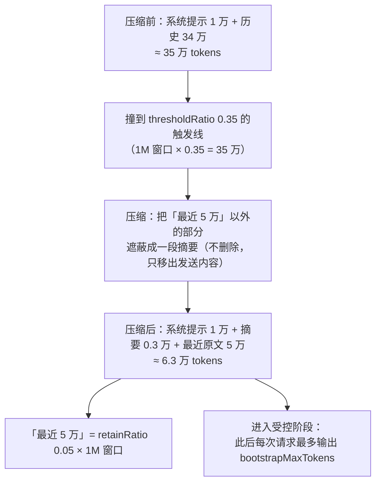

# 设计说明

本文件记录 `dsh-compact-agents` 的**契约出处**、**运行时语义**与**踩过的坑**，供维护者与审查者核对。所有结论都按**检出根目录的相对路径**标注(形如 `packages/compaction/...`)，可直接复查。

## 1. 为什么 DSH 没有现成的模型侧压缩入口

| 事实 | 位置 |
|---|---|
| 手动压缩的契约入口 `compactNow(agent, signal, sourceCommandId?)`，语义为"显式压缩，**即使低于自动压力阈值**" | `packages/compaction/compaction/src/index.ts:139` |
| 自动路径是 `compactIfNeeded(agent, trigger, signal)`，`trigger` 为 `'pressure' \| 'context-overflow'`——**尊重阈值**，不适用 | 同文件 `CompactionTrigger` |
| 唯一的 `compactNow` 调用者是 `/compact` 命令插件 | `packages/compaction/command-compact/src/index.ts:67` |
| 该命令经 `ctx.commands.register` 注册；命令解析只在交互式 UI 适配器里被调用 | `packages/compaction/command-compact/src/index.ts:101`、`packages/interaction/commands/src/index.ts:125/367` |
| `packages/compaction/` 下**没有任何** `registerTool` | 全目录检索 |

**结论**：headless 的子代理 / AgentTeams 成员没有命令面，队长也没有任何工具能替它们压缩。本插件补的就是这个缺口——把 `compactNow` 暴露成一个模型可调用的工具。

## 2. 运行时语义

### 2.1 覆盖范围

`ctx.agents.list()` 的定义是 *"All live agents, in registration order"*(`packages/core/agent/src/index.ts:587`)，返回**进程内所有活着的 agent**，与是否属于某个团队无关。`roots()`(`:597`)只返回 `owner === undefined` 的顶层 agent，用于越权判定；`get(id)`(`:567`)用于按 id 定位。

### 2.2 事件与作用域

- `agent/status` 的载荷是 `{ agent, status }`(`packages/core/agent/src/runtime-types.ts:277`)，由 agent loop 在每次状态迁移时发出(`packages/core/agent-loop/src/agent.ts:124`)。
- 它是**作用域事件**：路由主体是载荷里的 `agent`(`packages/core/scope/src/scoped-events.generated.ts:22`)。作用域标签的可见性规则是*"监听者带祖先标签即可收到后代派发的事件"*(`packages/core/scope/src/index.ts` 的 `scopeTarget` 注释)。
- 每个 agent 自建一个以自身对象为 key 的作用域(`packages/core/agent-loop/src/agent.ts:104`)；而 preset 的 standing mount 用一个**每个 preset 一份**的 key `{ agentPreset: <id> }` 建作用域(`packages/preset/agent-presets/src/index.ts:793`)，agent 的作用域挂在其下。
- **因此**：在 preset 组合里注册的监听器，能收到**该 preset 下所有 agent** 的状态事件——这正是排队机制能跨会话工作的原因。

### 2.3 生成代际与生效条件

- `ensureStanding` 每次比对 `compositionStamp` = `stat` 的 `mtimeMs` + `size`(`packages/preset/agent-presets/src/index.ts:829-843`)；戳变了就丢弃指针、为该 preset **重新挂载一代**，服务"本条及后续会话"。
- 子代理经 `composeFrom` → `standingMountFor(parentCtx)` 继承父代的 standing mount，**不再复查戳**。
- 已开始的会话会被 `select` / `swap` 以 `agent-preset/locked` 拒绝。

**操作结论**：改 preset 后**新开一条对话**即可生效，不必重启 DSH；但**重启会丢成员会话**，所以要压缩现有成员时应新开对话而不是重启。

### 2.4 忙碌与排队

`compactNow` 需要 `agent.runMaintenance`，该入口**仅限空闲**，agent 正在跑 turn 时同步抛 `ManualCompactionError('busy')`(`packages/compaction/compaction/src/index.ts:35-52`)。因此：

- 目标空闲 → 立即压缩，返回 `compacted`；
- 目标忙碌且 `whenBusy: "queue"`(默认) → 注册一次性的 `agent/status` 监听，等该 agent 转 `idle` 时补压，回报 `queued`；
- 调用者自己永远是忙碌的(它正在执行这次工具调用)，所以 `scope: "self"` **必然**走排队路径——这就是"没有子代理时主会话也能压自己"的实现方式。

监听器注册在插件自己的上下文上，随插件销毁；fire 后立即自注销，并用 `Set` 去重，避免同一 agent 被重复排队。

## 3. 踩过的坑

### 3.1 `isConcurrencySafe` 必须是**谓词**，不是布尔

`ToolDefinition` 里它的类型是 `isConcurrencySafe?(args: unknown): boolean`(`packages/core/tools/src/index.ts:261`)。`defineTool` 只在选项**为真值**时才保留该字段(`packages/core/tools/src/schema.ts`：`if (userIsConcurrencySafe)`)，所以写 `isConcurrencySafe: false` 会被**静默丢掉**，注册表里读到的是 `undefined`。正确写法：

```js
isConcurrencySafe: () => false,
```

好在漏掉时的默认值也是 `exclusive`(`packages/core/tools/src/index.ts:1268`：`if (!tool?.isConcurrencySafe) return { kind: 'exclusive' }`)，所以危害是"意图没被记录、默认值一变就悄悄失效"，但它是真 bug——由 `integration-test.mjs` 抓出并加了断言(既断言谓词返回值，也断言 `ctx.tools.executionMode()` 的实测结果)。

### 3.2 preset 行的模块解析

- 绝对盘符路径 → `pathToFileURL` → `file:` 行(`packages/preset/agent-presets/src/specifier.ts:47`，注释写明"专为 Windows 盘符路径所必需")；
- **裸包名在 preset 里是从 harness 解析的**，不是从调用方目录；指向用户目录的包会解析失败；
- 本项目刻意零依赖，靠 junction 让插件自己能解析 `@deepseek-ai/dsh-tools`；Node 把 junction 解析到真实路径，因此与宿主是**同一个模块实例**。

### 3.3 挂载行必须留在 `compaction` 隔离组内

该组的 `isolate: { compaction: true, ... }` 让组内解析到本组提供的 `compaction` 服务(由 `compaction-basic` 提供)。挂到组外会解析不到 `ctx.compaction`。

### 3.4 改插件代码必须重启 DSH(ESM 模块缓存)

Node 的 ESM 模块缓存 `internal.loadCache` 按 **URL** 命中，而 preset 重新挂载仍用同一个 `file:` URL，因此**不会**重新执行插件模块：`PresetTree.import` 最终走 `internal.import(specifier, base, {})`(`packages/preset/agent-presets/src/mount.ts:102`)。

DSH 自带的 HMR 插件能热重载，正是因为它显式遍历并删除 `loadCache` 里对应 URL 的条目(`vendor/hmr/src/index.ts:467` 附近)；该插件在 profile 里默认 `disabled`。

**结论**：改 `index.js` ⇒ 必须重启 `dsh` 才生效；改 `install.mjs` 或 preset ⇒ 新开一条对话即可。`scripts/*.mjs` 是每次直接执行的脚本，不受模块缓存影响。

### 3.5 行级文本插入，而不是 YAML 往返

preset 里含注释与 `!!js` 表达式。用 YAML 反序列化再序列化会把注释、表达式与排版全部重写掉，等于毁掉用户的配置文件。因此安装脚本只做**行级文本插入**，并保证：

- 插在 `compaction` 组的**最后一行之后**(让既有的服务提供者排在前面，与已验证的排布一致)；
- 缩进按该组的实际缩进推导；
- 相邻行之间补空行，与文件排版一致；
- 幂等(已有该行则跳过)、改前留 `.bak`。

卸载按同样的行级方式删除，并吞掉多余空行——实测**安装 → 卸载后文件逐字节回到原状**。

## 4. 验证矩阵

| 脚本 | 层次 | 断言要点 |
|---|---|---|
| `selftest.mjs` | 模块 | 可导入；`defineTool` 接受规格；工具名 `compact_agents`；参数枚举 `scope=others,all,self,ids`、`whenBusy=queue,skip`；`timeoutMs=1800000` |
| `deferred-test.mjs` | 行为(假 ctx) | 首次忙 → 回报 `queued`；**无关 agent 的 idle 不误触发**；真正 idle 后 `compactNow` 被再次调用；一次性监听器已注销；日志含遮蔽统计 |
| `integration-test.mjs` | 真机(真 Context + 真 ToolRuntime) | `inject` 解析；注册表可查出工具；参数/输出 schema 存在；`isConcurrencySafe` 是谓词且返回 `false`；`executionMode` 实测 `exclusive`；`execute(scope=others)` 排除调用者；返回值字段与 `CompactionResult` 一致；行内含压缩前后 token；`render()` 产出文本块；子代理扫描被拒；`scope=self` 忙时排队不报错；**`compaction/start` 追加可见提示(来源/summary/`surfaceOp`/非空 id)**；**`compaction/end` 给出 `213,400 → 49,800` 与遮蔽计数**；**失败压缩报"未完成"**；**无关事件不产生提示**；**`notice: false` 关掉提示但保留工具**；**`max-tokens` 轮结束自动续写一次且消息为冻结的 user**；**连续两次续写、第三次被上限拦住并播报**；**正常结束的轮次归还额度**；**`maxAutoContinues: 0` 关闭** |
| `validate-presets.mjs` | 配置 | 每份 preset 可解析(含 `!!js` 标签)；挂载行在 `compaction` 组内；引用的绝对路径存在且指向本项目；报告 `thresholdRatio` / `retainRatio` |

`integration-test.mjs` 用四个最小桩服务(`systemPrompt` / `compaction` / `tokenMeter` / `agents`)代替整个 Harness，所以**零模型调用、零成本**，可以随时跑。

## 5. 与自动压缩的关系

本插件**不修改**自动策略，二者互补：

- `compaction-basic` 在**每一步边界**检查 `totalTokens >= contextWindow × thresholdRatio`，达线即摘要并遮蔽旧表面节点，然后**继续该轮**；
- 并在 `CONTEXT_WINDOW_EXCEEDED` 时强制压缩后重试(`maxOverflowRetries` 默认 1)；
- 触发线 = `contextWindow × thresholdRatio`，判定是 `measurement.totalTokens < spec.thresholdTokens` 就直接返回、否则压缩(`packages/compaction/compaction-basic/src/index.ts:305`)，即**达到阈值就压**。例如 1M 窗口 × 0.35 = **350K tokens** 触发(× 0.3 = 300K)；`retainRatio: 0.05` 保留最近 5%(50K)原文。
- DSH 默认 `thresholdRatio` 是 **0.8**(1M 窗口 ⇒ 800K)，实际等于"几乎永不触发"；安装脚本在校验输出里报告这个值，便于确认。

## 6. 压缩提示：为什么只能这么做

### 6.1 问题：对话区在压缩期间是**空的**

客户端为压缩注册了一个对话节点，但它在压缩**结束前不渲染**：

```ts
// packages/client/ui-chat/src/client/conversation-nodes/compaction.ts
buildViewNode: (context) => {
  const state = context.state ?? fallbackState(context)
  if (state.checkpoint === undefined) return null   // 没有完成检查点 ⇒ 不渲染
```

`checkpoint` 来自 `compactSource()`，而它匹配的是**压缩提交后才写入**的那条替代 `user/message`。所以从 `compaction/start` 到 `compaction/end` 之间，对话区没有任何节点 —— **自带自动压缩完全一样**：`正在压缩上下文…` 这个文案只存在于"轨迹"面板(`packages/client/ui-trajectory/src/client/locales.ts`)。

这就是观感"卡住"的来源：摘要模型调用要几秒到几十秒，而这段时间界面上什么都没有。

### 6.2 可选路径，以及为什么选了这条

| 方案 | 结论 |
|---|---|
| 改客户端 `compaction.ts`，让运行中也渲染一个节点 | **效果最好，但要改 DSH 本体 + 重建 `apps/web/dist`**。本项目坚持纯主机侧插件，放弃 |
| 追加自定义的 **log-only** 事件 | 不行：客户端兜底只渲染"表面事件"(`isAppendSurfaceEvent`)，未知的 log-only 事件没有任何节点 |
| 追加 `command/run` + `command/done` | 能借命令节点渲染出"运行中"，但那是**冒用别的子系统的事件**，会污染命令会话记录，放弃 |
| **追加插件来源的 `user/message`** | ✅ 采用。这正是框架自己注入"上下文注入"时用的通路 |

### 6.3 采用的实现

```js
session.append('user/message', {
  id: randomUUID(),
  role: 'user',
  content: [{ type: 'text', text: body }],
  source: { kind: 'plugin', plugin: 'dsh-compact-agents', form: 'notice', summary },
}, { surfaceOp: 'append' })
```

三点依据：

1. **客户端就是这么渲染的**。`source.kind === 'plugin'` 的 `user/message` 走 `ContextInjectionRow`，渲染成折叠行「上下文注入 · <插件名> · <摘要>」，不是用户气泡；`ContextFormed` 的 `{ form: 'notice', summary }` 让折叠态就带一行结论(`packages/llm/llm/src/message.ts:81`)。
2. **时序正好**。订阅 `session/event`(提交后同步派发的观察者 feed)，`compaction/start` 是在摘要模型调用**之前**追加的(`packages/compaction/compaction-basic/src/region.ts`，`session.append('compaction/start', lifecycle)` 在 `await summarizeCompaction(...)` 之上)，所以提示覆盖的正是那段静默等待；这一步用 `ctx.tokenMeter.measure(session)` 记下压缩前的估算。
3. **不会打破压缩**。契约明确允许："Context injected while the summary runs may sit between the marker pair; **only the selected span must remain stable**"(`packages/compaction/compaction/src/index.ts`，`compactNow` 的文档)。我们追加在表面尾部，不触碰被替换的区间，因此不会触发 `assertSelectedSpanStable` 失败。

**提示里还要报"本会话用哪一档阈值"**（v0.6.1 补）。理由是一次几乎必然撞上的困惑：preset 里的压缩参数在**会话建立时**被读进 `compaction-basic`，它在构造时就 `resolveConfig()` 并 `deepFreeze`(`packages/compaction/compaction-basic/src/index.ts:129`)，之后改 preset 只对之后新建的会话生效 —— `agent-presets` 的 standing mount 虽然按文件戳换代，但"already joined"的会话保留自己那一代，且 `select`/`swap` 对已开始的会话直接抛 `agent-preset/locked`(`packages/preset/agent-presets/src/index.ts:735`)。于是"我改成 0.5 了，怎么还在 200K 压"必然发生，而旧提示只报 token 数、看不出用的是哪一档。

- 生效值从 `ctx.compaction.config.thresholdRatio` 读（同一 realm 内就是提供 `ctx.compaction` 的 `compaction-basic` 实例）；**读不到就整句不出现**，不把"报诊断"变成新的失败点。
- 配置里带 `modelPolicies` 时全局值并非实际生效值，这种情况按"读不到"处理（不猜）。
- 再读一次 preset 文件里的现值；两者不一致就在提示里写明"preset 现在是 ×A，本会话仍按 ×B，新开一条对话才会用上新值"。读文件是只读的，与 settings 面共用 `readPresetValues`。

> ⚠️ 别把提示挂在 `stability: 'whole-surface'` 的那条路径上：`compactRegion(start, end, agent, signal)` 用整面快照比对(`assertWholeSurfaceUnchanged`)，运行期追加任何表面节点都会让它抛 `SurfaceChangedError`。自动压力路径与 `compactNow` 都是 `selected-span`，安全。

### 6.4 代价（诚实披露）

- 提示是 `user/message`，**会进入模型上下文**：每次压缩多几十个 token，模型下一轮能看到"刚压过"。这是有意的。
- 两条提示里都写了"这是一条状态提示，不需要回应"，避免模型把它当用户发言来回答。
- 行配置 `notice: false` 整体关闭；关闭后工具行为不变。
- 提示只对**能收到 `session/event` 的**上下文生效。preset 行挂在 `agentCtx` 上(`presets.mount(agentCtx, …)`，其文档写明 "the mount's registrations and listeners cover this agent")，所以该 agent 自己的压缩都能看到；没有事件总线的测试桩会被静默跳过。

## 7. 被输出上限截断：诊断与自动续写

### 7.1 现象

压缩之后对话区出现「已达到输出 token 上限 / 回答被截断…发送"继续"可让模型接着输出」，模型这一轮**一个字都没输出**，必须手动发"继续"。

### 7.2 诊断（全部来自实机会话日志）

客户端文案由 `turn/end` 的 `reason.kind === 'max-tokens'` 渲染（`ui-chat/conversation-nodes/turn-max-tokens.ts`；DeepSeek 适配器把 `finish_reason: 'length'` 映射成它，`llm-deepseek/src/translate.ts`），且该状态在整轮内**粘住**：任一步触顶，后面即使有正常结束的步也不会清除（`agent-loop/src/agent.ts`）。

把同一个会话日志里的 4 次截断对齐到时间线，**4/4 都落在 `compaction/end` 之后 9~12 条记录**，且每次都是：

```
request/header  … "reasoningEffort":"high","maxTokens":1024
assistant/message  usage: outputTokens=1024, reasoningTokens=1024   ← 正文 0 字
turn/end           {"kind":"max-tokens"}
```

`maxTokens: 1024` 不是适配器默认值（`llm-deepseek` 的 `DEFAULT_MAX_TOKENS` 是 256000），而是 preset 的 `tool-bootstrap` 给的：它在**每次 `compaction/end`** 把会话重置回受控阶段（`resetToControlled`），并在 `agent/request` 上强制 `maxTokens = bootstrapMaxTokens`，直到晋升后才剥掉：

```js
// <preset>/tool-bootstrap.mjs
if (event.type === 'compaction/end') resetToControlled(state, session)   // 每次压缩都重回受控阶段
ctx.on('agent/request', async (payload, next) => {
  const resolved = await next()
  return state.promoted ? resolved : { ...resolved, maxTokens: policy.bootstrapMaxTokens }
}, { prepend: true })
```

该开关的本意是"community-observed **We need trigger window**"——用极小的输出预算逼模型给出极简计划。**但它没考虑推理模型**：`max_tokens` 同时覆盖思考 token。实测同一会话 761 次带思考的请求：中位 371、75 分位 962、90 分位 1826、95 分位 2455、**最大 8574**，其中 **175 次（23%）≥ 1024**。于是这个窗口在 1024 下经常整份被思考吃光：正文 0 字，既没有"We need"锚定，还额外赔掉一整轮。

**结论**：这不是 DSH 的 bug，也不是本插件的 bug，而是 preset 的一个假设（模型不推理）在 `reasoningEffort: high` 下失效；阈值调到 0.2 让压缩真的开始发生之后才暴露出来。

### 7.3 两层处置

1. **根因侧（配置）**：把该 preset 的 `bootstrapMaxTokens` 调到能容纳"思考 + 正文"的量级（本机调到 16384：覆盖实测最大思考 8574 后仍留约 7800 token 正文，且远低于适配器默认 256000）。受控阶段的其它机制（裁剪工具面、最小提示、延迟注入）不受影响。
2. **兜底侧（本插件）**：`turn/end{reason: 'max-tokens'}` 时自动续写一次。

### 7.4 自动续写的实现要点

```js
ctx.on('session/event', (session, event) => {
  if (event.type !== 'turn/end' || event.data.reason.kind !== 'max-tokens') { /* 正常结束：归还额度 */ }
  const agent = agents.list().find(a => a.session === session)
  agent.followup(continueMessage())   // = 人在界面上发一句话
})
```

| 决策 | 理由 |
|---|---|
| 用 `agent.followup(message)` 而不是 `session.append` | 前者是 `send(message,'next-turn',true)` + `wakeDriver`，**与人类发消息完全同路**（`session-controller/src/commands.ts` 里就是这么调）。单纯往表面 append 一条 `user/message` 不会唤醒 driver，对话仍然停着 |
| 消息 `source.kind` 用 `'user'` | preset 的 `messageSources` 白名单（如 `[user, goal]`）会过滤预步骤注入；用 `plugin` 来源可能被过滤出模型表面，`继续` 就白发了。代价是它在对话区显示为用户气泡 —— 因此额外播报一条提示行说明是自动发的 |
| 手写消息而不是 import `createUserMessage` | 语义等价（`deepFreeze(structuredClone(…))` + 新 id），但 `@deepseek-ai/dsh-llm` 在 harness 根 `node_modules` 里不存在，插件里的裸导入会解析失败（只保证 `@deepseek-ai/dsh-tools` 可解析） |
| 用 `setTimeout(…, 0)` 离开当前派发再开新一轮 | 避免在 `session/event` 观察者回调里重入 driver |
| **有次数上限**（`maxAutoContinues`，默认 2） | "截断→续写→又截断"会无止境烧 token。用满后改为播报提示，让人来决定 |
| **任一轮正常结束即清零** | 额度是"连续"次数：换了一个正常回答之后，下次再从 1 开始，不会长期耗尽 |
| 找不到活 agent 就放弃 | 会话可能已经结束；自动续写只服务于还能跑的会话 |

## 8. 设置面：把旋钮搬进「设置」界面

目标：压缩触发阈值、保留比例、受控阶段输出预算、提示开关、自动续写次数，五项都能在
**设置 → 插件 → 可配置** 里改，不必再编辑 preset 的 YAML。

### 8.1 走官方正路，而不是自己画一个界面

DSH 的设置页对插件命名空间是**泛型**的：`ConfigurablePluginsTab` 枚举
`ctx.settingsScope.describe()` 里的命名空间，为每个命名空间渲染一个由插件自己提供的卡片
（`renderSlot('settings.plugin.item', {}, { entryKey: ns })`）。slot 契约把站外插件这条路
写得很明白：

> Keying on the namespace is what lets a plugin distributed outside this repository contribute a
> card: it registers its own settings namespace on the Host and its own card under that key in the
> browser, and the tab pairs the two without ever learning what the namespace means.

于是：宿主侧 `settings.register('compact-agents', schema, { base, applies })`，浏览器侧
`ctx.slots.register({ name: 'settings.plugin.item', key: 'compact-agents', inject }, Card)`。
**没有通用兜底界面** —— 插件不提供卡片，那个命名空间在设置页里就不出现，所以卡片是必需品。

| 决策 | 理由 |
|---|---|
| 宿主注册命名空间 + 自己写浏览器 half | 这是官方支持的站外插件形态；自己去改 DSH 的设置页属于改宿主 |
| 浏览器 half 手写成单文件 bundle，不引打包器 | DSH 的客户端模块系统本身就是一张惰性 CJS 表（`window.__ModuleLoader__.load({ id, factory })`），产物形态可以直接照抄。项目"零依赖、离线可用"的原则因此不需要为界面破例 |
| 只 require 种子模块 `react` 与 `@deepseek-ai/dsh-client-store` | 种子模块由 shell 直接提供，不需要 `dsh.client.external`（没声明 external 却 require 非种子包会在启动时报错）。settings 通道走**服务** `ctx.settingsScope`，只在 `dsh.client.inject` 里声明包依赖边 |
| 登记键写 `key:` 而不是 `entryKey:` | 产物 `ui-settings-plugins/lib/client.js` 里注册用的是 `key`；`entryKey` 是**渲染侧** `renderSlot` 的派发选项。两者不能混 |
| **进程级只注册一次** | `SettingsProvider.register()` 对重复命名空间直接 `throw`，而注册挂在该 provider 的 fiber 上、不随调用者卸载。本插件挂在 preset 行上、每次换代都会重新 apply，所以必须用模块级缓存复用同一个 scope，否则换代时那一行会直接挂掉 |
| 命名空间的 `base` 用 preset 文件里的**现值** | 设置页显示的就该是"真正生效的值"，而不是插件凭空给的默认值；三层优先级是「schema 默认 < 作文层（行配置 + preset 现值）< 用户层（界面）」 |
| `applies: 'restart'` | 五项里三项要等新会话才生效，取保守声明；卡片上逐项写明真实时机 |

### 8.2 两类值，两种生效机制

前三个值**属于 preset 里的其它插件**（`compaction-basic` 的 `thresholdRatio`/`retainRatio`、
`tool-bootstrap` 的 `bootstrapMaxTokens`）。插件改不了别人的运行时策略，所以改的是
**preset 文件本身**：preset 的挂载会记录文件 stamp，stamp 变了就给**之后新建的会话**开新一代
（`agent-presets` 的 mount 契约："Sessions already joined keep the generation they run on"）。
不用重启 DSH，但已在运行的会话不受影响。

后两个值是**本插件自己的**，会话事件发生时才读，所以改完立即生效。

| 决策 | 理由 |
|---|---|
| 按行做文本手术，不反序列化再序列化 | preset 里有注释、`!!js` 表达式和排版；读进来再写出去等于把别人的配置文件重排一遍。只定位目标 row 的 `config` 块、只替换目标那一行 |
| 写前备份 + 临时文件 rename | `<preset>.bak-compact-agents` 常驻一份"最近一次写前"的内容；rename 是原子的。设置面板改配置不该有把 preset 写坏的可能 |
| 越界值直接拒绝 | 设置页与宿主 schema 两侧都校验，且宿主侧再挡一道范围，避免手改 settings.yaml 写出荒谬的阈值 |
| **`liveConfig` 只存"用户层覆盖"**，`null` 表示没覆盖 | 这是踩出来的：本插件按 preset 行多处挂载，行配置各不相同，而命名空间是**进程级唯一**的。第一版把解析结果直接写进模块级 `liveConfig`，于是任一个 preset 写的 `notice: false` 会把**所有** preset 的提示一起关掉（集成测试当场抓到这个回归）。现在解析结果与 `base` 比对，相等就退回各挂载自己的行配置 |

### 8.3 验证

| 层 | 覆盖 |
|---|---|
| 文本手术 | 嵌套 `config` 块的定位、兄弟 row 不串键、注释与缩进保留、只改一行、键不存在时插入、同一值不重写 |
| 落盘 | 备份内容、无残留临时文件、字节级"只有目标行变了"、越界拒绝、幂等 |
| 注册 | 命名空间名、`applies`、`base` 携带行配置与 preset 现值、schema 真能解析、**二次挂载不重复注册**、变更后自身旋钮立即生效且 preset 参数落盘 |
| 两端一致性 | 卡片里的字段集合必须**逐个等于**宿主 schema 的字段；两端的命名空间字符串必须一致。这个接口是刻意在两端各写一份的，没有守卫就会悄悄漂移 |
| 浏览器 half | 工厂 id = 包名、`apply`/`inject` 形态、只 require 种子模块、注册进 `settings.plugin.item` 且 `key` 正确、真 React 渲染出五个字段与生效时机、越界阻止保存、`status !== 'ready'` 只渲染提示不抛、保存走 `scope.set`、重置走 `scope.unset`、写入被拒不抛 |

### 8.4 为什么浏览器 half 需要一行落在宿主组成里

`ClientModuleRegistry`（`packages/client/modules/src/index.ts`）决定把哪些客户端 bundle 下发给浏览器，
而它**只认宿主 Loader 的 entries**：

- 构造时只做 `for (const entry of ctx.loader.entries())`；
- 增量监听走 `ctx.on('internal/plugin', fiber => { const entryName = fiber.entry?.options.name; if (entryName === undefined) return; … })`
  —— 那行 `return` 是整段语义的核心：`fiber.entry` 为空的是"子插件或手动挂载"，直接丢弃。

preset 里的行由 `agent-presets` 用 `internal.import` **手动挂载**（见 3.2），本来就不是 loader 行，
`fiber.entry` 为空。于是：

| 只挂 preset 时的症状 | 机制 |
|---|---|
| 设置页里没有这个命名空间 | 宿主侧注册那一层同样没被扫到 |
| 设置页里没有那张卡片 | 浏览器根本没收到 `lib/client.js` |
| **没有任何报错** | 整条丢弃路径是静默的，日志里也看不出来 |

**两个挂载点的职责分工**：

| 挂载点 | 谁建的 | 载体 | 负责 | 为什么必须在这里 |
|---|---|---|---|---|
| preset 行 | `install.mjs` | `<DSH_HOME>/.agent-presets/*/agent.cordis.yml` 的 `compaction` 组 | `compact_agents` 工具、压缩进度提示、`max-tokens` 后自动续写 | 必须待在 `compaction` realm 内（见 3.3）：cordis 的隔离按服务名生效，realm 外解析不到 `ctx.compaction` |
| 宿主组成里的 bundle 行 | `install.mjs --profile`（登记 profile 的 `dsh.profile.bundles`；包内 `dsh.bundle.patch` → `cordis.patch.yml`） | 宿主 Loader 的一行：`id: compact-agents-client-host` / `name: 'dsh-compact-agents/client-host'`（入口 `client-host.js`） | 被 `client-modules` 扫到（从而把 `lib/client.js` 下发给浏览器）、在宿主根注册 settings 命名空间 | 只有 loader 行才进得了 `ClientModuleRegistry`；手动挂载的行在 `fiber.entry` 那一行就被丢弃 |

**为什么 `client-host.js` 的 `inject = []`**：宿主根上**没有** `compaction` 服务（它由 preset realm 内的
`compaction-basic` 提供），声明这个依赖只会让这一行永远 pending。所以这个入口不依赖任何服务，只做两件事：
让 `client-modules` 扫到本包的 `dsh.client` 声明、在宿主根上注册 settings 命名空间。工具与提示仍归 preset 行。

**注册只做一次，但要等服务就绪**：两处入口都调用 `registerSettings`，靠 `settings.js` 的模块级缓存保证
**进程级只注册一次**（真实的 `SettingsProvider.register` 对重复命名空间直接抛错）。而 bundle 行完全可能
**早于提供 `settings` 服务的那一层**被 apply —— compose 顺序由 profile 的 `bundles` 顺序决定 —— 所以
`registerSettings` 用 `ctx.inject(['settings'], cb)` **等服务就绪**再注册，而不是同步取一次
`ctx.get('settings')` 取不到就放弃：旧写法在这种情况下会**静默地什么都不注册**，症状与上表第一条完全一样。

**形态先例**：这不是自创写法。已装的站外插件 `@a9i5k4/dsh-auto-memory` 就是同一形态 —— `package.json`
声明 `dsh.bundle.patch: './cordis.patch.yml'`、`dsh.client: { platform: 'web', inject: [ …, '@deepseek-ai/dsh-client-ui-settings' ] }`
与 `exports['./client']: './lib/client.js'`，patch 内容就是 `- insert: [ { id, name } ]`。本插件采用与它相同的形态。

**这一节的结论怎么验证的**：

| 手段 | 证明什么 |
|---|---|
| `scripts/compose-test.mjs` | 用**检出里真实的 `FileSettingsProvider`**（写到临时文件，绝不碰真实 `settings.yaml`）而不是桩，并复刻 preset 的 `isolate` 语义（`ctx.isolate('compaction', …)`）跑通 —— 证明"在真实服务 + 真实隔离作用域下也注册得上"，也就是设置页确实会列出这个命名空间 |
| 同上，另一段 | 刻意**先挂宿主组成那一行、后挂 `settings` 服务**，证明 `ctx.inject` 的等待路径真的在服务到场后完成了注册 —— 这正是上文那句"毫无报错"的回归测试 |
| `scripts/inspect-presets.mjs` | **只读**核对真实 preset 里读到的生效值（设置页将显示的初值），一个文件都不写 |
| 源码对照 | `ClientModuleRegistry` 的两处遍历与那行 `return` 直接抄自检出源码（`packages/client/modules/src/index.ts`），不是推断 |

> ⚠️ **测试隔离教训**：`compose-test.mjs` 会走真实的 `update → watch → 写回` 链路。第一版没有把 preset
> 读写指向临时夹具，于是这个"验证"脚本**真的改写了用户的 preset** —— 把 `thresholdRatio` 写成了 `0.42`。
> 现在它在最前面调用 `setPresetFilesForTest([临时夹具])`，开头还会拍下真实 preset 的**全文快照**、结尾逐字节比对：
> 只要有一个字被改动就立即失败（`npm test` 会跑到它，也可以单独 `node scripts/compose-test.mjs`）。
> 判据刻意**不是**"阈值必须是某个数字" —— `thresholdRatio` 本来就是给人调的旋钮，硬编码期望值会把
> 「用户调过参」（本机四份 preset 都是 `0.5`）误报成「测试污染了配置」，让这条防线恒失败。
> 凡是要写盘的测试，夹具必须显式指向临时文件，不能依赖"我以为它不会写"。

## 9. 压缩参数的机制与调参取舍

§5 列出了那几个旋钮，§8.2 讲了两类生效机制；这一节补上**它们为什么长这样、调它们各自的代价是什么**。
用户视角的"怎么理解、怎么调"在仓库根 `README.md` 的「每个参数到底在管什么」一节，这里只讲机制与设计理由。

### 9.1 一次压缩的完整链路（示意）

以 1M 窗口（≈100 万 tokens）、`thresholdRatio: 0.35`、`retainRatio: 0.05`、`bootstrapMaxTokens: 16384` 为例：

```
压之前   系统提示 1 万 + 历史 34 万 = 35 万
         └─ totalTokens ≥ 窗口 × 0.35 → 达线，进入压缩

压缩中   summarizeCompaction(...) 真实调用一次摘要模型
         把"最近 5 万"以外的表面节点【遮蔽】(mask) 掉，并换成摘要
         └─ 遮蔽 = 移出发送内容，不是删除节点；回报里的"遮蔽节点数"就是这次选中的区间

压之后   系统提示 1 万 + 摘要 0.3 万 + 最近原文 5 万 ≈ 6.3 万
         └─ "最近 5 万" = retainRatio 0.05 × 窗口 100 万

随后     tool-bootstrap 在 compaction/end 上 resetToControlled：
         此后每个 agent/request 被强制 maxTokens = bootstrapMaxTokens，直到会话晋升
```

三个参数各管一段，互不重叠：`thresholdRatio` 管**触发**，`retainRatio` 管**保真边界**，
`bootstrapMaxTokens` 管**压完那几轮的输出上限**。没有一个参数管"摘要写得好不好"——那是摘要模型自己的职责，
本插件与这两个 preset 插件都不介入。

把上面这条链路画成流程图（节点数值与文字版逐字一致）：



### 9.2 为什么必须留一块原文（`retainRatio` 的设计理由）

- 摘要是**有损**的：细节、精确的标识符、代码片段都可能被抹掉。
- 但**近因**恰恰最可能马上被用到：刚贴的代码、刚提的需求、刚纠正的错误。全量摘要化就会得到
  "我刚说过的它当没看见"这种最伤信任的表现。
- 所以设计上把"保真"做成一条**可调的线**，而不是全有或全无：线内原文一字不差，线外只剩摘要。
- 单位取**窗口比例**而不是**消息条数**：条数与 token 量完全不成比例（一条贴了 500 行代码的消息
  可以顶上几百条短消息），而成本的真实量纲是 token。这也是它不能被"最近 N 条"替代的原因。

| 调整 | 代价 |
|---|---|
| 调小（如 `0.01` = 保留 1 万） | 一个几百行的代码文件就接近 1 万 tokens，刚贴的内容压完即被总结掉，表现为"转头就忘" |
| 调大（如 `0.2` = 保留 20 万） | 压完仍剩约 25 万，很快再次撞线 → **压缩抖动**：反复压、反复打断 |
| `0.05`（现值） | 一般对话够用；经常贴大文件的场景建议 `0.08~0.1` |

### 9.3 为什么压缩后要进"受控阶段"（`bootstrapMaxTokens` 的设计理由）

该开关（受控阶段）的本意是 "community-observed **We need trigger window**"：用极小的输出预算逼模型先给出
极简计划，再放开。它挂在 `compaction/end` 上（`resetToControlled`），所以**每次压缩之后**都会重新进入
受控阶段——设计意图是防止"刚清出来的空间被一篇长回答又塞满"，让这次压缩不至于白做。会话"晋升"
（`state.promoted`）之后 `agent/request` 上的强制 `maxTokens` 被剥掉，恢复模型本身的大预算，
所以**受控阶段是压缩之后的一段临时限流，不是永久设置**。

关键约束在于：**`max_tokens` 同时覆盖思考（reasoning）token**。这不是 DSH 的 bug，而是该 preset 的一个
隐含假设（模型不推理）在 `reasoningEffort: high` 下失效——压缩阈值调到 0.2、压缩真的开始发生之后才暴露。
实测同一会话 761 次带思考的请求：思考 token 中位 371、75 分位 962、90 分位 1826、95 分位 2455、最大 8574，
其中 **23% ≥ 1024**；而 preset 把 `bootstrapMaxTokens` 给了 1024，于是这个窗口经常整份被思考吃光
（本机 4/4 次截断都是 `outputTokens=1024, reasoningTokens=1024`、正文 0 字，见 §7）。插件的兜底是
"被截断时自动续写"（§7.4），代价是现象变成**锯齿状输出**（说一半 → 自动继续 → 接着说）。

| 调整 | 代价 |
|---|---|
| 调小（如 `1024`） | 省，但思考一超线就正文 0 字；靠自动续写补，来回多花轮次 |
| 调大（如 `32768`） | 不易截断，但受控阶段每轮都可能很贵，且"重新锚定/极简计划"的设计意图被削弱 |
| `16384`（现值） | 覆盖实测最大思考 8574 后仍留约 7800 token 正文，是折中值 |

### 9.4 为什么这三个值只能写进 preset

`thresholdRatio` / `retainRatio` 属于 `compaction-basic`，`bootstrapMaxTokens` 属于 `tool-bootstrap`。
运行时策略在各自的插件里，本插件没有修改别人策略的接口，所以只能改**preset 文件本身**：
preset 的 standing mount 按文件 stamp（`mtimeMs` + `size`）识别新一代，因此改动**只对之后新建的会话生效**，
已经在运行的会话保持它 join 时的那一代——与 §2.3、§8.2 是同一套机制。反过来，压缩提示开关与自动续写次数
是本插件自己的行配置，事件发生时才读，**改完立即生效**。

这也是"为什么不去改运行时策略"的理由：越过所属插件直接改运行时值，就等于在别人的契约之外动它的状态；
写 preset 文件则是走它自己的配置入口，且天然留下 `.bak-compact-agents` 备份与可回滚的文本差异。

### 9.5 速查：调参的取舍方向

| 目标 | 调整 |
|---|---|
| 更省钱、更快 | 阈值调小（早压）+ 保留比例调小 |
| 少打断、记得住刚说的 | 保留比例调大（`0.08~0.1`） |
| 受控阶段老被截断（反复自动续写） | 输出预算调大（`32768`） |
| 压缩太频繁、嫌它老在总结 | 阈值调大（`0.3~0.4`） |

恢复默认：各字段的「重置」回到 preset 里的值；`thresholdRatio: 0.8` 是 DSH 出厂值（1M 窗口 ⇒ 800K，
实际等于"几乎永不触发"）。


